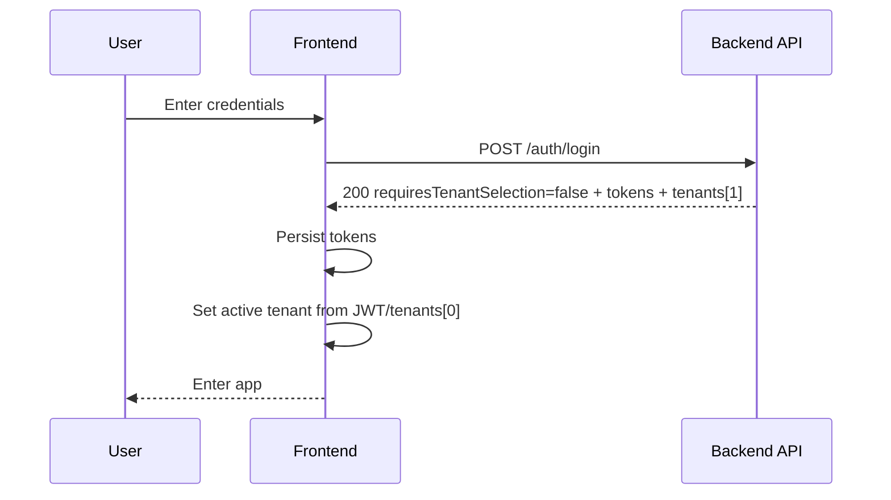
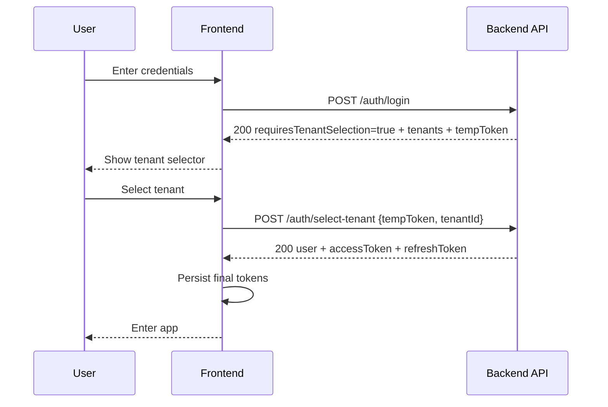
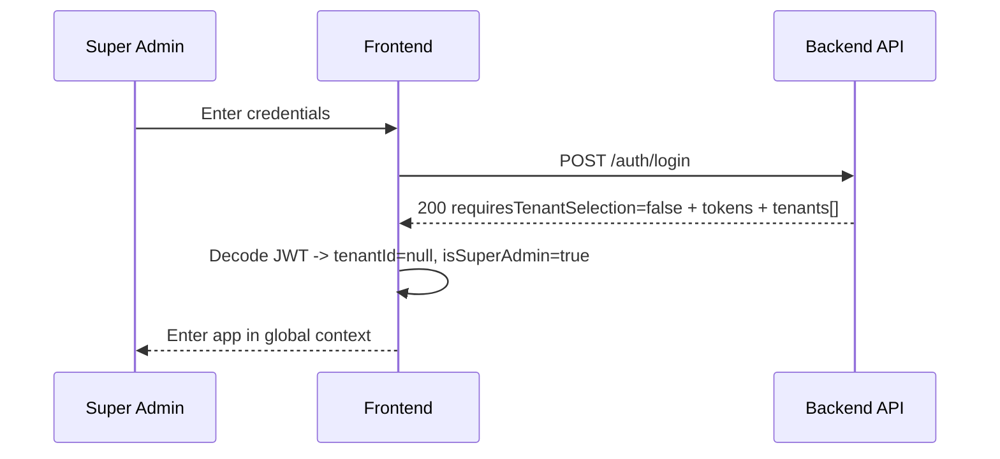
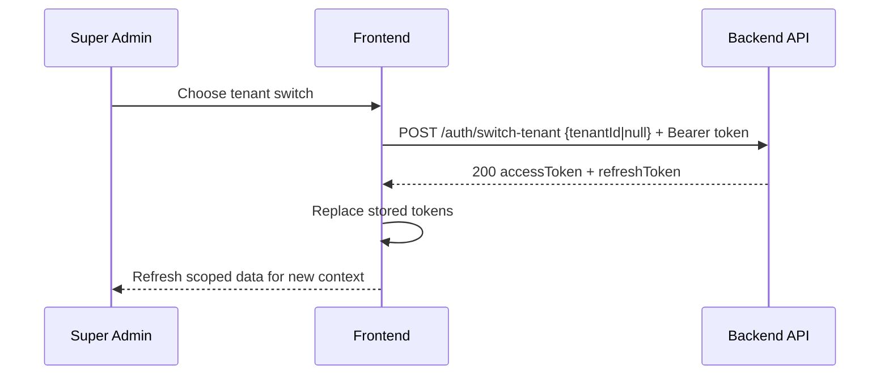

# Multi-Tenant API Integration Guide (Frontend)

This document is the frontend source of truth for the multi-tenant auth + API behavior introduced in the backend.

---

## 1) Breaking Changes Summary

1. **Old JWTs are no longer valid**  
   All users must log in again because JWT claims changed.

2. **`POST /auth/login` response is now conditional**  
   Login can return either final tokens **or** a temporary tenant-selection token.

3. **New required flow for multi-tenant users**  
   Users with more than one active tenant must pick a tenant via `POST /auth/select-tenant` before receiving final tokens.

4. **Tenant-scoped endpoints now require tenant context in JWT**  
   Endpoints for products, sales, orders, customers, promotions, price-lists, files, admin users, and admin roles enforce tenant-scoped access.

5. **`UserRole` was removed and replaced by `TenantMembership`**  
   Role resolution is now per-tenant through memberships.

---

## 2) New JWT Payload

```json
{
  "sub": "user-uuid",
  "email": "user@example.com",
  "tenantId": "tenant-uuid | null",
  "tenantSlug": "centro | null",
  "isSuperAdmin": true
}
```

Notes:
- `tenantId: null` means **global context** (super-admin only).
- `tenantSlug` is included in JWT and should be treated as derived context for UI display/routing helpers.

---

## 3) TypeScript Contracts

```ts
export interface TenantSummary {
  id: string
  name: string
  slug: string
}

export interface UserSummary {
  id: string
  email: string
  name: string
  isActive: boolean
  createdAt: string
}

export interface AuthTokens {
  accessToken: string
  refreshToken: string
}

export interface LoginSuccessResponse extends AuthTokens {
  requiresTenantSelection: false
  user: UserSummary
  tenants: TenantSummary[]
}

export interface LoginTenantSelectionResponse {
  requiresTenantSelection: true
  user: UserSummary
  tenants: TenantSummary[]
  tempToken: string
  expiresIn: 300
}

export type LoginResponse =
  | LoginSuccessResponse
  | LoginTenantSelectionResponse

export interface SelectTenantRequest {
  tempToken: string
  tenantId: string
}

export interface SelectTenantResponse extends AuthTokens {
  user: UserSummary
}

export interface SwitchTenantRequest {
  tenantId?: string | null
}

export interface SwitchTenantResponse extends AuthTokens {}

export interface AuthMeMembership {
  id: string
  name: string
  slug: string
}

export interface AuthMeResponse {
  id: string
  email: string
  name: string
  isActive: boolean
  createdAt: string
  tenant: AuthMeMembership | null
  memberships: AuthMeMembership[]
}

export interface ApiError {
  statusCode: number
  error: {
    code: string
    message: string
    details?: Record<string, unknown>
  }
  timestamp: string
  path: string
}
```

---

## 4) Login Flow (Detailed)

### Case A: Single-Tenant User

```http
POST /auth/login
Content-Type: application/json

{ "email": "manager@houndfe.com", "password": "Manager123!" }
```

```json
{
  "requiresTenantSelection": false,
  "user": { "id": "...", "email": "...", "name": "...", "isActive": true, "createdAt": "..." },
  "tenants": [{ "id": "...", "name": "Sucursal Centro", "slug": "centro" }],
  "accessToken": "...",
  "refreshToken": "..."
}
```

Frontend action:
- Store tokens and continue.
- `tenants[0]` is the active tenant context for the issued token.

---

### Case B: Multi-Tenant User

```http
POST /auth/login
Content-Type: application/json

{ "email": "user@houndfe.com", "password": "StrongPass123!" }
```

```json
{
  "requiresTenantSelection": true,
  "user": { "id": "...", "email": "...", "name": "...", "isActive": true, "createdAt": "..." },
  "tenants": [
    { "id": "tenant-a", "name": "Sucursal Centro", "slug": "centro" },
    { "id": "tenant-b", "name": "Sucursal Norte", "slug": "norte" }
  ],
  "tempToken": "...",
  "expiresIn": 300
}
```

Frontend action:
- Do **not** enter app yet.
- Show tenant picker.
- Call `POST /auth/select-tenant`.

```http
POST /auth/select-tenant
Content-Type: application/json

{ "tempToken": "...", "tenantId": "tenant-a" }
```

```json
{
  "user": { "id": "...", "email": "...", "name": "...", "isActive": true, "createdAt": "..." },
  "accessToken": "...",
  "refreshToken": "..."
}
```

Frontend action:
- Store final access/refresh tokens.
- Proceed to app.

---

### Case C: Super Admin

```http
POST /auth/login
Content-Type: application/json

{ "email": "admin@houndfe.com", "password": "Admin123!" }
```

Response shape is `requiresTenantSelection: false` + tokens + tenants list.  
JWT contains `tenantId: null` and `isSuperAdmin: true` (global context).

> Important: current backend login response does **not** include a top-level `isSuperAdmin` field; determine this from JWT claims and/or `/auth/me/permissions`.

Super-admin tenant switch:

```http
POST /auth/switch-tenant
Authorization: Bearer <accessToken>
Content-Type: application/json

{ "tenantId": "tenant-uuid" }
```

or return to global context:

```http
POST /auth/switch-tenant
Authorization: Bearer <accessToken>
Content-Type: application/json

{ "tenantId": null }
```

```json
{
  "accessToken": "...",
  "refreshToken": "..."
}
```

---

### Case D: No Active Tenants (non-super-admin)

```http
POST /auth/login
Content-Type: application/json

{ "email": "no-tenant@houndfe.com", "password": "..." }
```

Expected:
- HTTP `403`
- Tenant access denied error contract (code-based handling in frontend)

---

## 5) Mermaid Sequence Diagrams

### (a) Single-tenant login flow



### (b) Multi-tenant login + selection



### (c) Super-admin global context login



### (d) Tenant switch flow



---

## 6) Tenant Selection UX Requirements

- If `requiresTenantSelection === true`, show required tenant selector UI.
- `tempToken` expires in **5 minutes** (`expiresIn: 300`):
  - show countdown **or**
  - handle expiry by returning to login when select fails.
- After successful tenant selection, store returned `accessToken` + `refreshToken` as normal auth session.
- Super-admins should have a tenant switcher in app header/navbar.

---

## 7) `/auth/me` Response

Current backend response:

```json
{
  "id": "user-uuid",
  "email": "user@example.com",
  "name": "User Name",
  "isActive": true,
  "createdAt": "2026-05-01T00:00:00.000Z",
  "tenant": { "id": "...", "name": "Sucursal Centro", "slug": "centro" },
  "memberships": [
    { "id": "...", "name": "Sucursal Centro", "slug": "centro" }
  ]
}
```

Important compatibility note:
- The current implementation does **not** include top-level `isSuperAdmin` or `memberships[].roleName` in `/auth/me`.
- If frontend needs role display per membership, obtain it from role-related endpoints/permissions flow.

---

## 8) New Endpoints Reference

| Method | Path | Auth | Description |
|---|---|---|---|
| POST | `/auth/select-tenant` | Public (`tempToken`) | Select tenant after multi-tenant login |
| POST | `/auth/switch-tenant` | JWT (super-admin) | Switch tenant context |
| POST | `/admin/tenants` | JWT (super-admin) | Create tenant |
| GET | `/admin/tenants` | JWT (super-admin) | List all tenants |
| GET | `/admin/tenants/:id` | JWT (super-admin) | Get tenant details |
| PATCH | `/admin/tenants/:id` | JWT (super-admin) | Update tenant |
| DELETE | `/admin/tenants/:id` | JWT (super-admin) | Deactivate tenant |
| POST | `/admin/tenants/:tenantId/members` | JWT (super-admin) | Add member |
| GET | `/admin/tenants/:tenantId/members` | JWT (super-admin) | List members |
| PATCH | `/admin/tenants/:tenantId/members/:membershipId` | JWT (super-admin) | Update member role |
| DELETE | `/admin/tenants/:tenantId/members/:membershipId` | JWT (super-admin) | Remove member |

---

## 9) Modified Endpoints Behavior

All existing tenant-scoped endpoint families now:
- Require JWT tenant context (`tenantId`) unless explicitly allowed global super-admin flow.
- Auto-scope reads/writes by current tenant.
- Must **not** receive `tenantId` from frontend body/params for scoping.
- Return only current-tenant data.

Applies to: products, sales, orders, customers, promotions, price-lists, files, admin users, admin roles.

---

## 10) Error Codes Reference

| Code | HTTP | When |
|---|---:|---|
| `TENANT_REQUIRED` | 401 | Missing tenant context on scoped endpoint |
| `TENANT_ACCESS_DENIED` | 403 | User not allowed for selected tenant |
| `TENANT_NOT_FOUND` | 404 | Tenant ID does not exist |
| `TENANT_INACTIVE` | 403 | Tenant is deactivated |
| `TENANT_SELECTION_REQUIRED` | 200 | Login requires tenant selection state |
| `TENANT_ALREADY_EXISTS` | 409 | Duplicate tenant slug/name |
| `TENANT_MEMBERSHIP_EXISTS` | 409 | Duplicate membership assignment |
| `ROLE_TENANT_MISMATCH` | 400 | Role does not belong to target tenant |
| `SUPER_ADMIN_REQUIRED` | 403 | Operation requires super-admin |
| `GLOBAL_CONTEXT_REQUIRED` | 403 | Operation requires `tenantId: null` |
| `INVALID_TEMP_TOKEN` | 401 | Temp token expired/invalid |

---

## 11) Frontend Migration Guide (Step-by-step)

1. **Update token handling**
   - Decode/store new claims: `tenantId`, `tenantSlug`, `isSuperAdmin`.

2. **Update login flow**
   - Branch on `requiresTenantSelection`.

3. **Implement tenant selector**
   - Required for multi-tenant login.
   - Handle `tempToken` expiry gracefully.

4. **Update API client behavior**
   - Stop sending tenant header/query/body for scoping.
   - Scope comes from JWT context on backend.

5. **Update `/auth/me` parsing**
   - Use current fields (`tenant`, `memberships`, etc.).

6. **Add super-admin tenant switcher**
   - Use `POST /auth/switch-tenant`.
   - Replace tokens on every switch.

7. **Handle new tenant-related errors**
   - Especially `TENANT_REQUIRED`, `TENANT_ACCESS_DENIED`, `INVALID_TEMP_TOKEN`.

8. **Test full matrix**
   - Single tenant, multi-tenant, super-admin global, super-admin switched tenant, no-active-tenant rejection.

---

## 12) cURL Examples

### Login

```bash
curl -X POST http://localhost:3000/auth/login \
  -H "Content-Type: application/json" \
  -d '{"email":"manager@houndfe.com","password":"Manager123!"}'
```

### Select tenant (multi-tenant flow)

```bash
curl -X POST http://localhost:3000/auth/select-tenant \
  -H "Content-Type: application/json" \
  -d '{"tempToken":"<temp-token>","tenantId":"<tenant-uuid>"}'
```

### Switch tenant (super-admin)

```bash
curl -X POST http://localhost:3000/auth/switch-tenant \
  -H "Authorization: Bearer <access-token>" \
  -H "Content-Type: application/json" \
  -d '{"tenantId":"<tenant-uuid>"}'
```

### Return to global context (super-admin)

```bash
curl -X POST http://localhost:3000/auth/switch-tenant \
  -H "Authorization: Bearer <access-token>" \
  -H "Content-Type: application/json" \
  -d '{"tenantId":null}'
```

### Auth me

```bash
curl -X GET http://localhost:3000/auth/me \
  -H "Authorization: Bearer <access-token>"
```

---

## 13) Test Credentials

- Super Admin: `admin@houndfe.com` / `Admin123!`
- Manager (Centro): `manager@houndfe.com` / `Manager123!`
- Cashier (Centro): `cashier@houndfe.com` / `Cashier123!`
