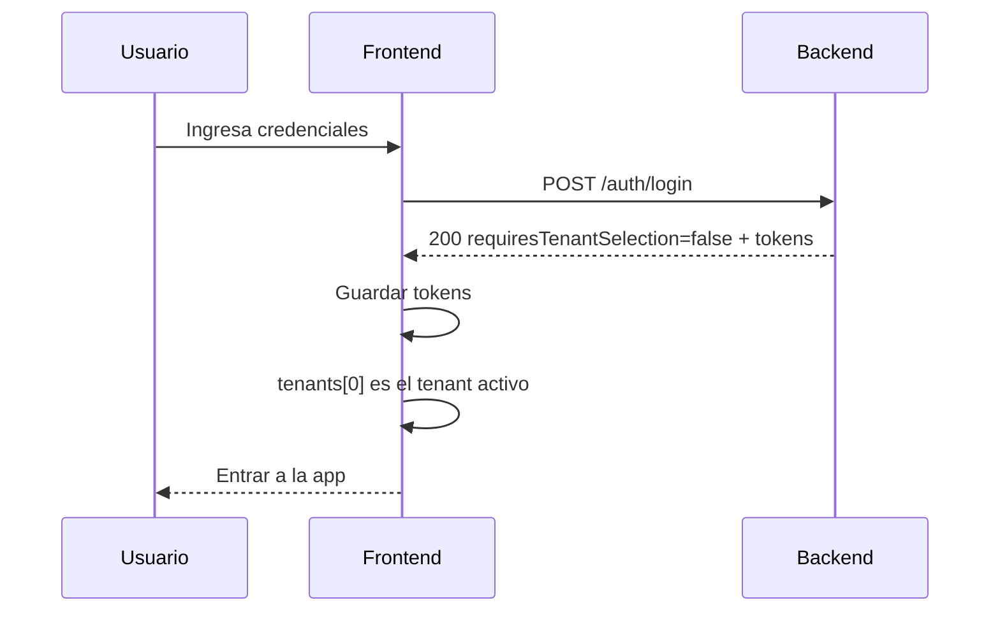
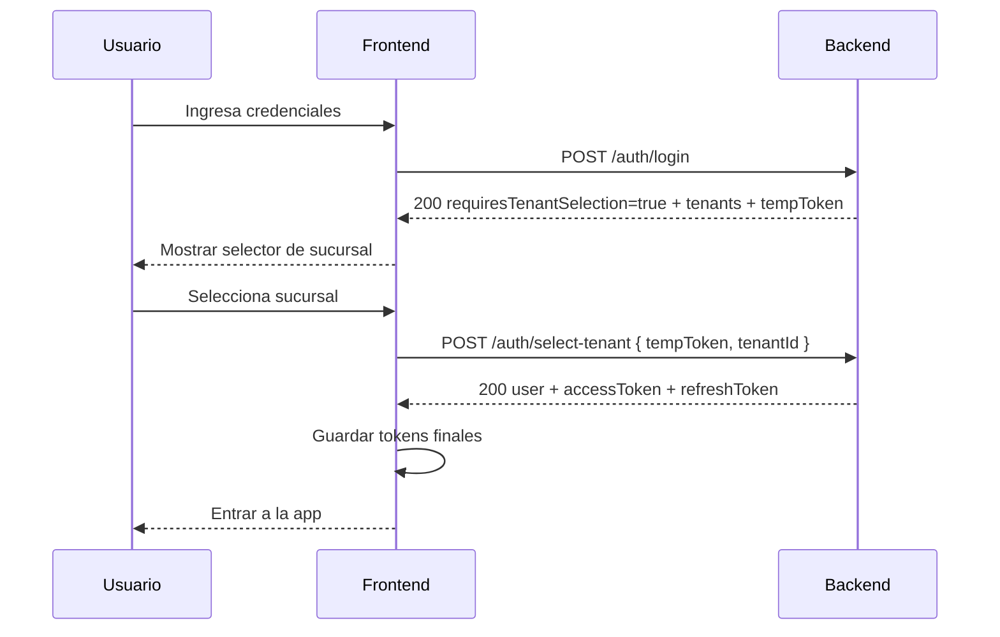
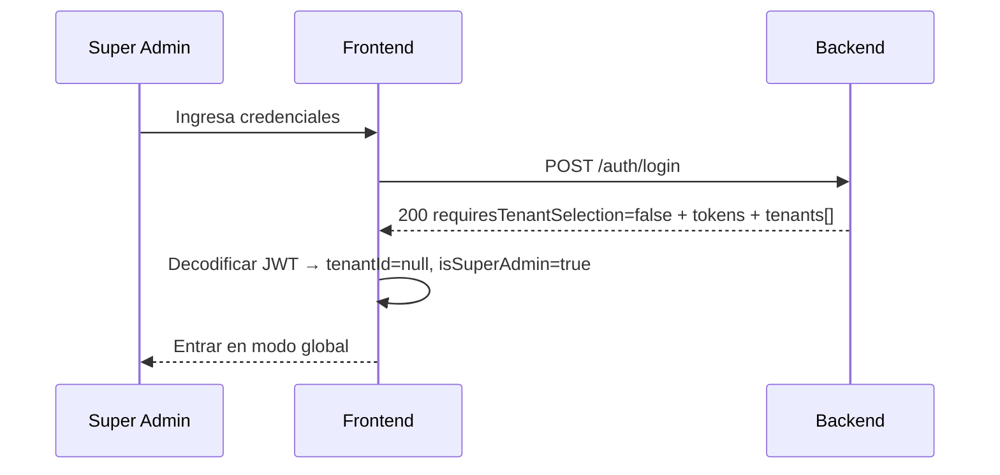
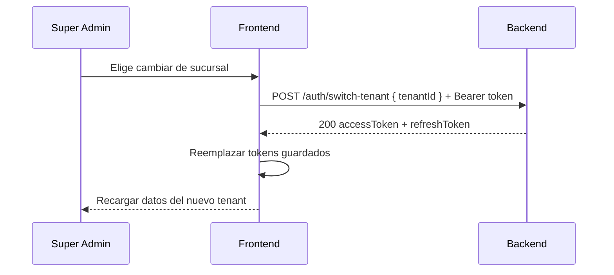

# Multi-Tenant API — Guía de Integración Frontend

> **Audiencia**: Equipo frontend.
> **Última actualización**: 2026-05-02.

---

## Tabla de Contenidos

1. [¿Qué es multi-tenant y por qué se hizo?](#1-qué-es-multi-tenant-y-por-qué-se-hizo)
2. [¿Qué cambió a nivel general?](#2-qué-cambió-a-nivel-general)
3. [Prioridad de implementación](#3-prioridad-de-implementación)
4. [Fase 1 — Login y selección de tenant](#4-fase-1--login-y-selección-de-tenant)
5. [Fase 2 — Endpoints existentes (productos, ventas, etc.)](#5-fase-2--endpoints-existentes-productos-ventas-etc)
6. [Fase 3 — Super Admin: switch de tenant](#6-fase-3--super-admin-switch-de-tenant)
7. [Fase 4 — Panel de administración de tenants](#7-fase-4--panel-de-administración-de-tenants)
8. [Fase 5 — Administración de membresías](#8-fase-5--administración-de-membresías)
9. [Referencia completa de endpoints](#9-referencia-completa-de-endpoints)
10. [Referencia de códigos de error](#10-referencia-de-códigos-de-error)
11. [TypeScript Interfaces (copiar/pegar)](#11-typescript-interfaces-copiarpegar)
12. [Diagramas de flujo (Mermaid)](#12-diagramas-de-flujo-mermaid)
13. [cURL de referencia](#13-curl-de-referencia)
14. [Credenciales de prueba](#14-credenciales-de-prueba)
15. [FAQ](#15-faq)

---

## 1. ¿Qué es multi-tenant y por qué se hizo?

El cliente tiene **múltiples sucursales** (actualmente 3, escalará a ~30). Antes cada sucursal usaba una instancia separada del sistema. Ahora **un solo sistema maneja todas las sucursales** con datos completamente aislados.

**Tenant = Sucursal**. Cada tenant tiene sus propios:
- Productos, variantes, lotes, imágenes
- Ventas, órdenes
- Clientes
- Promociones
- Listas de precios
- Archivos

Lo que **SÍ se comparte** entre todos los tenants:
- Categorías
- Marcas
- Usuarios (un usuario puede pertenecer a varias sucursales)
- Definiciones de permisos

---

## 2. ¿Qué cambió a nivel general?

### Breaking changes (TODO esto rompe el frontend actual)

| Cambio | Impacto |
|--------|---------|
| **JWT nuevo** | Ahora incluye `tenantId`, `tenantSlug`, `isSuperAdmin`. Todos los tokens viejos son inválidos. |
| **Login condicional** | `POST /auth/login` ya NO siempre devuelve tokens. Si el usuario tiene más de 1 sucursal, devuelve un `tempToken` y hay que hacer un paso extra. |
| **Contexto de tenant obligatorio** | TODOS los endpoints de datos (productos, ventas, clientes, etc.) requieren un JWT con `tenantId`. Sin eso → `401`. |
| **`UserRole` ya no existe** | Se reemplazó por `TenantMembership`. Los permisos ahora son **por sucursal**. |
| **Nuevos endpoints** | `POST /auth/select-tenant`, `POST /auth/switch-tenant`, CRUD de tenants, CRUD de membresías. |

### Qué NO cambió
- Los paths de endpoints existentes siguen iguales (`/products`, `/sales`, etc.)
- Los request/response bodies de endpoints existentes siguen iguales
- El frontend NO necesita enviar `tenantId` en ningún body, header ni query param — el backend lo saca del JWT automáticamente

---

## 3. Prioridad de implementación

Implementar en este orden. Cada fase es independiente y entregable:

| Orden | Qué | Por qué primero |
|-------|-----|-----------------|
| **Fase 1** | Login + selección de tenant | Sin esto, nada funciona. TODO el sistema depende del nuevo flow de auth. |
| **Fase 2** | Adaptar endpoints existentes | Solo es manejar el nuevo error `TENANT_REQUIRED` (401) y guardar los nuevos campos del JWT. |
| **Fase 3** | Switch de tenant (super-admin) | Necesario para que el super-admin navegue entre sucursales. |
| **Fase 4** | Panel admin de tenants | CRUD de sucursales — solo super-admin. |
| **Fase 5** | Admin de membresías | Asignar/remover usuarios de sucursales. |

---

## 4. Fase 1 — Login y selección de tenant

### Nuevo JWT payload

```json
{
  "sub": "user-uuid",
  "email": "user@example.com",
  "tenantId": "tenant-uuid",
  "tenantSlug": "centro",
  "isSuperAdmin": false
}
```

- `tenantId` → UUID del tenant activo, o `null` si es super-admin en contexto global.
- `tenantSlug` → Slug legible ("centro", "norte", "sur"), útil para mostrar en la UI.
- `isSuperAdmin` → `true` solo para super-admins. **Este campo está en el JWT, NO en el body de `/auth/me`**. Para saber si el usuario es super-admin, decodificar el JWT.

### `POST /auth/login` — Ahora es condicional

El login ya no siempre devuelve tokens. Hay 4 casos:

---

#### Caso A: Usuario con UNA sola sucursal

El más común. Login normal, tokens directos.

**Request:**
```http
POST /auth/login
Content-Type: application/json

{ "email": "manager@houndfe.com", "password": "Manager123!" }
```

**Response (200):**
```json
{
  "requiresTenantSelection": false,
  "user": {
    "id": "uuid",
    "email": "manager@houndfe.com",
    "name": "Manager Centro",
    "isActive": true,
    "createdAt": "2026-05-02T00:00:00.000Z"
  },
  "tenants": [
    { "id": "tenant-uuid", "name": "Sucursal Centro", "slug": "centro" }
  ],
  "accessToken": "eyJ...",
  "refreshToken": "eyJ..."
}
```

**Qué hacer en frontend:**
1. `requiresTenantSelection === false` → guardar `accessToken` y `refreshToken` normalmente.
2. `tenants[0]` es el tenant activo del token emitido.
3. Continuar a la app.

---

#### Caso B: Usuario con MÚLTIPLES sucursales

No se devuelven tokens finales. Se devuelve un `tempToken` de corta vida.

**Request:**
```http
POST /auth/login
Content-Type: application/json

{ "email": "multi@houndfe.com", "password": "Password123!" }
```

**Response (200):**
```json
{
  "requiresTenantSelection": true,
  "user": {
    "id": "uuid",
    "email": "multi@houndfe.com",
    "name": "Multi Sucursal User",
    "isActive": true,
    "createdAt": "2026-05-02T00:00:00.000Z"
  },
  "tenants": [
    { "id": "tenant-a", "name": "Sucursal Centro", "slug": "centro" },
    { "id": "tenant-b", "name": "Sucursal Norte", "slug": "norte" }
  ],
  "tempToken": "eyJ...",
  "expiresIn": 300
}
```

**Qué hacer en frontend:**
1. `requiresTenantSelection === true` → **NO entrar a la app todavía**.
2. Mostrar un selector de tenant con la lista de `tenants`.
3. `tempToken` expira en **5 minutos** (300 segundos). Mostrar countdown o manejar la expiración volviendo al login.
4. Cuando el usuario elige un tenant → llamar a `POST /auth/select-tenant`.

### `POST /auth/select-tenant` — Segundo paso del login multi-tenant

**Request:**
```http
POST /auth/select-tenant
Content-Type: application/json

{ "tempToken": "eyJ...", "tenantId": "tenant-a" }
```

**Response (200):**
```json
{
  "user": {
    "id": "uuid",
    "email": "multi@houndfe.com",
    "name": "Multi Sucursal User",
    "isActive": true,
    "createdAt": "2026-05-02T00:00:00.000Z"
  },
  "accessToken": "eyJ...",
  "refreshToken": "eyJ..."
}
```

**Qué hacer en frontend:**
1. Guardar `accessToken` y `refreshToken` normalmente.
2. Continuar a la app.

**Errores posibles:**

| HTTP | Código | Cuándo |
|------|--------|--------|
| 401 | `INVALID_TEMP_TOKEN` | Token expirado (pasaron más de 5 min) o inválido |
| 403 | `TENANT_ACCESS_DENIED` | El usuario no pertenece a ese tenant |
| 403 | `TENANT_INACTIVE` | El tenant fue desactivado |

---

#### Caso C: Super Admin

Login directo con tokens en contexto global (`tenantId: null`).

**Request:**
```http
POST /auth/login
Content-Type: application/json

{ "email": "admin@houndfe.com", "password": "Admin123!" }
```

**Response (200):**
```json
{
  "requiresTenantSelection": false,
  "user": {
    "id": "uuid",
    "email": "admin@houndfe.com",
    "name": "Super Admin",
    "isActive": true,
    "createdAt": "2026-05-02T00:00:00.000Z"
  },
  "tenants": [
    { "id": "t-1", "name": "Sucursal Centro", "slug": "centro" },
    { "id": "t-2", "name": "Sucursal Norte", "slug": "norte" },
    { "id": "t-3", "name": "Sucursal Sur", "slug": "sur" }
  ],
  "accessToken": "eyJ...",
  "refreshToken": "eyJ..."
}
```

**Qué hacer en frontend:**
1. Guardar tokens.
2. Decodificar JWT → `tenantId === null && isSuperAdmin === true` → modo global.
3. Mostrar un **tenant switcher** en el header/navbar para que el super-admin pueda entrar a cualquier sucursal.

**IMPORTANTE**: El response de login NO incluye un campo `isSuperAdmin`. Para saber si es super-admin, **decodificar el JWT** (`accessToken`) y leer el claim `isSuperAdmin`.

---

#### Caso D: Usuario sin sucursales activas (y no es super-admin)

**Response (403):**
```json
{
  "statusCode": 403,
  "message": "User does not belong to an active tenant"
}
```

**Qué hacer en frontend:**
Mostrar mensaje: "No tienes acceso a ninguna sucursal. Contacta al administrador."

---

### `POST /auth/refresh` — Refresh tokens

Funciona IGUAL que antes. El refresh token **preserva el contexto de tenant**.

**Request:**
```http
POST /auth/refresh
Content-Type: application/json

{ "refreshToken": "eyJ..." }
```

**Response (200):**
```json
{
  "accessToken": "eyJ...",
  "refreshToken": "eyJ..."
}
```

Los nuevos tokens mantienen el mismo `tenantId`, `tenantSlug` e `isSuperAdmin` que tenía el refresh token original. No hay que re-seleccionar tenant.

---

### `GET /auth/me` — Perfil del usuario autenticado

**Request:**
```http
GET /auth/me
Authorization: Bearer <accessToken>
```

**Response (200):**
```json
{
  "id": "user-uuid",
  "email": "user@example.com",
  "name": "Nombre del Usuario",
  "isActive": true,
  "createdAt": "2026-05-02T00:00:00.000Z",
  "tenant": {
    "id": "tenant-uuid",
    "name": "Sucursal Centro",
    "slug": "centro"
  },
  "memberships": [
    { "id": "tenant-uuid", "name": "Sucursal Centro", "slug": "centro" },
    { "id": "tenant-uuid-2", "name": "Sucursal Norte", "slug": "norte" }
  ]
}
```

**Notas:**
- `tenant` → el tenant activo actual. Es `null` si el super-admin está en contexto global.
- `memberships` → TODOS los tenants activos a los que pertenece el usuario (útil para mostrar el switcher si tienen más de uno).
- NO incluye `isSuperAdmin` ni `roleName` por membership. Para `isSuperAdmin` → decodificar JWT. Para el nombre del rol → usar `GET /auth/me/permissions`.

### `GET /auth/me/permissions` — Permisos del usuario en el tenant activo

**Request:**
```http
GET /auth/me/permissions
Authorization: Bearer <accessToken>
```

**Response (200):**
```json
{
  "permissions": [
    { "action": "read", "subject": "Product" },
    { "action": "create", "subject": "Sale" },
    { "action": "read", "subject": "Sale" }
  ],
  "permissionCodes": ["read:Product", "create:Sale", "read:Sale"]
}
```

Los permisos son los del **tenant activo** del JWT. Si el usuario cambia de tenant, los permisos pueden ser completamente diferentes.

---

## 5. Fase 2 — Endpoints existentes (productos, ventas, etc.)

### ¿Qué cambió?

**Nada en los paths ni en los bodies.** Los endpoints de productos, ventas, órdenes, clientes, promociones, listas de precios y archivos siguen exactamente igual. La única diferencia:

1. **Necesitan un JWT con `tenantId`** — si el JWT no tiene tenant context, devuelve `401 TENANT_REQUIRED`.
2. **El filtrado es automático** — el backend filtra por tenant transparentemente. El frontend NUNCA envía `tenantId` en body, query params ni headers.
3. **Los datos son aislados** — un usuario en Sucursal Centro solo ve productos, ventas, clientes de Centro. No sabe que existen otras sucursales.

### ¿Qué implementar?

Solo manejar el nuevo error `401` con código `TENANT_REQUIRED`:

```typescript
// En tu interceptor/middleware de API
if (error.response?.statusCode === 401) {
  const code = error.response?.data?.message;
  if (code === 'Tenant context required') {
    // El token no tiene tenant context — redirect a login o selector de tenant
  }
}
```

Y guardar `tenantSlug` del JWT en tu store para mostrarlo en la UI (ej: "Sucursal Centro" en el header).

---

## 6. Fase 3 — Super Admin: switch de tenant

### `POST /auth/switch-tenant` — Cambiar de sucursal (solo super-admin)

Permite al super-admin entrar a una sucursal específica o volver al contexto global.

**Entrar a una sucursal:**
```http
POST /auth/switch-tenant
Authorization: Bearer <accessToken>
Content-Type: application/json

{ "tenantId": "tenant-uuid" }
```

**Volver al contexto global:**
```http
POST /auth/switch-tenant
Authorization: Bearer <accessToken>
Content-Type: application/json

{ "tenantId": null }
```

**Response (200):**
```json
{
  "accessToken": "eyJ...",
  "refreshToken": "eyJ..."
}
```

**Qué hacer en frontend:**
1. Reemplazar los tokens guardados con los nuevos.
2. Recargar los datos de la vista actual (ya que ahora son del nuevo tenant).
3. Actualizar la UI del header/navbar con el nuevo tenant.

**Errores posibles:**

| HTTP | Código | Cuándo |
|------|--------|--------|
| 403 | `SUPER_ADMIN_REQUIRED` | El usuario no es super-admin |
| 403 | `TENANT_INACTIVE` | El tenant destino está desactivado |

**UX recomendada:**
- Mostrar un dropdown/selector en el header con la lista de tenants (se obtiene de `GET /auth/me` → `memberships` o de `GET /admin/tenants`).
- Opción "Global (todas las sucursales)" que envía `tenantId: null`.
- Al seleccionar → llamar switch-tenant → reemplazar tokens → recargar datos.

---

## 7. Fase 4 — Panel de administración de tenants

Todos estos endpoints requieren JWT de **super-admin**. Un usuario normal NO puede ver ni crear tenants.

### `POST /admin/tenants` — Crear tenant (sucursal)

**Request:**
```http
POST /admin/tenants
Authorization: Bearer <accessToken>
Content-Type: application/json

{
  "name": "Sucursal Poniente",
  "slug": "poniente",
  "address": "Av. Reforma 123, CDMX",
  "phone": "+52 55 1234 5678"
}
```

| Campo | Tipo | Requerido | Validación |
|-------|------|-----------|------------|
| `name` | string | Sí | No vacío |
| `slug` | string | Sí | Solo `a-z`, `0-9`, `-`. Ejemplo: `"sucursal-norte"`. Debe ser único. |
| `address` | string | No | — |
| `phone` | string | No | — |

**Response (201):**
```json
{
  "id": "uuid",
  "name": "Sucursal Poniente",
  "slug": "poniente",
  "isActive": true,
  "address": "Av. Reforma 123, CDMX",
  "phone": "+52 55 1234 5678",
  "createdAt": "2026-05-02T...",
  "updatedAt": "2026-05-02T..."
}
```

**Errores posibles:**

| HTTP | Código | Cuándo |
|------|--------|--------|
| 403 | `SUPER_ADMIN_REQUIRED` | No es super-admin |
| 409 | `TENANT_ALREADY_EXISTS` | Slug o name duplicado |
| 400 | Validación | Slug con caracteres inválidos, campos vacíos |

---

### `GET /admin/tenants` — Listar tenants

**Request:**
```http
GET /admin/tenants
Authorization: Bearer <accessToken>
```

Query params opcionales:

| Param | Tipo | Default | Descripción |
|-------|------|---------|-------------|
| `includeInactive` | `"true"` / `"false"` | `"false"` | Incluir tenants desactivados |

**Response (200):**
```json
[
  {
    "id": "uuid-1",
    "name": "Sucursal Centro",
    "slug": "centro",
    "isActive": true,
    "address": null,
    "phone": null,
    "createdAt": "2026-05-02T...",
    "updatedAt": "2026-05-02T..."
  },
  {
    "id": "uuid-2",
    "name": "Sucursal Norte",
    "slug": "norte",
    "isActive": true,
    "address": null,
    "phone": null,
    "createdAt": "2026-05-02T...",
    "updatedAt": "2026-05-02T..."
  }
]
```

---

### `GET /admin/tenants/:id` — Detalle de un tenant

**Response (200):** Mismo shape que un item del listado.

**Errores:** `404 TENANT_NOT_FOUND`

---

### `PATCH /admin/tenants/:id` — Actualizar tenant

**Request:**
```http
PATCH /admin/tenants/:id
Authorization: Bearer <accessToken>
Content-Type: application/json

{
  "name": "Sucursal Centro Renovada",
  "address": "Nueva dirección",
  "isActive": false
}
```

Todos los campos son opcionales (partial update):

| Campo | Tipo | Descripción |
|-------|------|-------------|
| `name` | string | Nuevo nombre |
| `slug` | string | Nuevo slug (mismas validaciones) |
| `address` | string | Nueva dirección |
| `phone` | string | Nuevo teléfono |
| `isActive` | boolean | Activar/desactivar tenant |

**Response (200):** Tenant actualizado completo.

---

### `DELETE /admin/tenants/:id` — Desactivar tenant (soft delete)

**NO elimina el tenant.** Solo pone `isActive = false`. Los datos se preservan.

**Response:** `204 No Content`

Cuando un tenant se desactiva:
- Los usuarios que pertenecen a ese tenant ya NO pueden hacer login con él.
- Si intentan seleccionarlo → `403 TENANT_INACTIVE`.
- Los datos del tenant siguen en la base de datos.

---

## 8. Fase 5 — Administración de membresías

Gestiona qué usuarios pertenecen a qué tenant y con qué rol.

### `POST /admin/tenants/:tenantId/members` — Agregar usuario a un tenant

**Request:**
```http
POST /admin/tenants/:tenantId/members
Authorization: Bearer <accessToken>
Content-Type: application/json

{
  "userId": "user-uuid",
  "roleId": "role-uuid"
}
```

| Campo | Tipo | Requerido | Descripción |
|-------|------|-----------|-------------|
| `userId` | UUID | Sí | ID del usuario (global) |
| `roleId` | UUID | Sí | ID del rol. **Debe pertenecer al mismo tenant.** |

**Response (201):**
```json
{
  "id": "membership-uuid",
  "userId": "user-uuid",
  "tenantId": "tenant-uuid",
  "roleId": "role-uuid"
}
```

**Errores posibles:**

| HTTP | Código | Cuándo |
|------|--------|--------|
| 400 | `ROLE_TENANT_MISMATCH` | El rol no pertenece a ese tenant |
| 409 | `TENANT_MEMBERSHIP_EXISTS` | El usuario ya tiene ese rol en ese tenant |
| 403 | `TENANT_ACCESS_DENIED` | No tiene permisos para gestionar ese tenant |

---

### `GET /admin/tenants/:tenantId/members` — Listar miembros de un tenant

**Response (200):**
```json
[
  {
    "id": "membership-uuid",
    "userId": "user-uuid",
    "tenantId": "tenant-uuid",
    "roleId": "role-uuid"
  }
]
```

---

### `PATCH /admin/tenants/:tenantId/members/:membershipId` — Cambiar rol

**Request:**
```http
PATCH /admin/tenants/:tenantId/members/:membershipId
Authorization: Bearer <accessToken>
Content-Type: application/json

{ "roleId": "new-role-uuid" }
```

**Response (200):** Membership actualizado.

**Errores:** `400 ROLE_TENANT_MISMATCH`, `404 TENANT_MEMBERSHIP_NOT_FOUND`

---

### `DELETE /admin/tenants/:tenantId/members/:membershipId` — Remover usuario del tenant

**Response:** `204 No Content`

---

## 9. Referencia completa de endpoints

### Endpoints nuevos

| Método | Path | Auth | Fase |
|--------|------|------|------|
| `POST` | `/auth/select-tenant` | Público (usa `tempToken`) | 1 |
| `POST` | `/auth/switch-tenant` | JWT (super-admin) | 3 |
| `POST` | `/admin/tenants` | JWT (super-admin) | 4 |
| `GET` | `/admin/tenants` | JWT (super-admin) | 4 |
| `GET` | `/admin/tenants/:id` | JWT (super-admin) | 4 |
| `PATCH` | `/admin/tenants/:id` | JWT (super-admin) | 4 |
| `DELETE` | `/admin/tenants/:id` | JWT (super-admin) | 4 |
| `POST` | `/admin/tenants/:tenantId/members` | JWT (super-admin o admin del tenant) | 5 |
| `GET` | `/admin/tenants/:tenantId/members` | JWT (super-admin o admin del tenant) | 5 |
| `PATCH` | `/admin/tenants/:tenantId/members/:membershipId` | JWT (super-admin o admin del tenant) | 5 |
| `DELETE` | `/admin/tenants/:tenantId/members/:membershipId` | JWT (super-admin o admin del tenant) | 5 |

### Endpoints modificados (mismos paths, nuevo comportamiento)

Todos estos ahora requieren JWT con `tenantId` y filtran automáticamente por tenant:

- `/products/**`
- `/sales/**`
- `/orders/**`
- `/customers/**`
- `/promotions/**`
- `/price-lists/**`
- `/files/**`
- `/admin/users/**`
- `/admin/roles/**`

---

## 10. Referencia de códigos de error

| Código | HTTP | Cuándo | Fase |
|--------|------|--------|------|
| `TENANT_REQUIRED` | 401 | Falta tenant context en el JWT | 2 |
| `TENANT_ACCESS_DENIED` | 403 | Usuario no pertenece al tenant seleccionado | 1 |
| `TENANT_NOT_FOUND` | 404 | El tenant ID no existe | 4 |
| `TENANT_INACTIVE` | 403 | El tenant fue desactivado | 1, 3 |
| `TENANT_ALREADY_EXISTS` | 409 | Slug o nombre duplicado | 4 |
| `TENANT_MEMBERSHIP_EXISTS` | 409 | Membresía duplicada | 5 |
| `TENANT_MEMBERSHIP_NOT_FOUND` | 404 | Membresía no existe | 5 |
| `ROLE_TENANT_MISMATCH` | 400 | El rol no pertenece al tenant indicado | 5 |
| `SUPER_ADMIN_REQUIRED` | 403 | Operación requiere super-admin | 3, 4 |
| `GLOBAL_CONTEXT_REQUIRED` | 403 | Operación requiere `tenantId: null` | 4 |
| `INVALID_TEMP_TOKEN` | 401 | Token temporal expirado o inválido | 1 |

---

## 11. TypeScript Interfaces (copiar/pegar)

```typescript
// ─── Tenant ────────────────────────────────────────────────

export interface TenantSummary {
  id: string;
  name: string;
  slug: string;
}

export interface Tenant {
  id: string;
  name: string;
  slug: string;
  isActive: boolean;
  address: string | null;
  phone: string | null;
  createdAt: string;
  updatedAt: string;
}

export interface TenantMembership {
  id: string;
  userId: string;
  tenantId: string;
  roleId: string;
}

// ─── Auth ─────���────────────────────────────────────────────

export interface UserSummary {
  id: string;
  email: string;
  name: string;
  isActive: boolean;
  createdAt: string;
}

export interface AuthTokens {
  accessToken: string;
  refreshToken: string;
}

/** Login cuando requiresTenantSelection === false */
export interface LoginSuccessResponse extends AuthTokens {
  requiresTenantSelection: false;
  user: UserSummary;
  tenants: TenantSummary[];
}

/** Login cuando requiresTenantSelection === true */
export interface LoginTenantSelectionResponse {
  requiresTenantSelection: true;
  user: UserSummary;
  tenants: TenantSummary[];
  tempToken: string;
  expiresIn: 300;
}

export type LoginResponse = LoginSuccessResponse | LoginTenantSelectionResponse;

export interface SelectTenantRequest {
  tempToken: string;
  tenantId: string;
}

export interface SelectTenantResponse extends AuthTokens {
  user: UserSummary;
}

export interface SwitchTenantRequest {
  tenantId: string | null;
}

export interface SwitchTenantResponse extends AuthTokens {}

export interface RefreshTokenRequest {
  refreshToken: string;
}

export interface RefreshTokenResponse extends AuthTokens {}

export interface AuthMeResponse {
  id: string;
  email: string;
  name: string;
  isActive: boolean;
  createdAt: string;
  tenant: TenantSummary | null;
  memberships: TenantSummary[];
}

export interface EffectivePermission {
  action: string;
  subject: string;
}

export interface UserPermissionsResponse {
  permissions: EffectivePermission[];
  permissionCodes: string[];
}

// ─── JWT Claims (decodificar del accessToken) ──────────────

export interface JwtClaims {
  sub: string;
  email: string;
  tenantId: string | null;
  tenantSlug: string | null;
  isSuperAdmin: boolean;
  iat: number;
  exp: number;
}

// ─── Tenant Admin DTOs ─────────────────────────────────────

export interface CreateTenantRequest {
  name: string;
  slug: string;
  address?: string;
  phone?: string;
}

export interface UpdateTenantRequest {
  name?: string;
  slug?: string;
  address?: string;
  phone?: string;
  isActive?: boolean;
}

export interface CreateMembershipRequest {
  userId: string;
  roleId: string;
}

export interface UpdateMembershipRequest {
  roleId: string;
}

// ─── Error Response ───────���────────────────────────────────

export interface ApiError {
  statusCode: number;
  message: string;
  error?: string;
}
```

---

## 12. Diagramas de flujo (Mermaid)

### Login: usuario con una sucursal



### Login: usuario con múltiples sucursales



### Login: Super Admin



### Switch de tenant (Super Admin)



---

## 13. cURL de referencia

### Login
```bash
curl -X POST http://localhost:3000/auth/login \
  -H "Content-Type: application/json" \
  -d '{"email":"manager@houndfe.com","password":"Manager123!"}'
```

### Select tenant (multi-tenant flow)
```bash
curl -X POST http://localhost:3000/auth/select-tenant \
  -H "Content-Type: application/json" \
  -d '{"tempToken":"<temp-token>","tenantId":"<tenant-uuid>"}'
```

### Switch tenant (super-admin)
```bash
curl -X POST http://localhost:3000/auth/switch-tenant \
  -H "Authorization: Bearer <access-token>" \
  -H "Content-Type: application/json" \
  -d '{"tenantId":"<tenant-uuid>"}'
```

### Volver a contexto global
```bash
curl -X POST http://localhost:3000/auth/switch-tenant \
  -H "Authorization: Bearer <access-token>" \
  -H "Content-Type: application/json" \
  -d '{"tenantId":null}'
```

### Auth me
```bash
curl -X GET http://localhost:3000/auth/me \
  -H "Authorization: Bearer <access-token>"
```

### Refresh token
```bash
curl -X POST http://localhost:3000/auth/refresh \
  -H "Content-Type: application/json" \
  -d '{"refreshToken":"<refresh-token>"}'
```

### Crear tenant (super-admin)
```bash
curl -X POST http://localhost:3000/admin/tenants \
  -H "Authorization: Bearer <access-token>" \
  -H "Content-Type: application/json" \
  -d '{"name":"Sucursal Poniente","slug":"poniente"}'
```

### Listar tenants
```bash
curl -X GET http://localhost:3000/admin/tenants \
  -H "Authorization: Bearer <access-token>"
```

### Agregar miembro a tenant
```bash
curl -X POST http://localhost:3000/admin/tenants/<tenant-uuid>/members \
  -H "Authorization: Bearer <access-token>" \
  -H "Content-Type: application/json" \
  -d '{"userId":"<user-uuid>","roleId":"<role-uuid>"}'
```

---

## 14. Credenciales de prueba

| Rol | Email | Password | Tenants |
|-----|-------|----------|---------|
| Super Admin | `admin@houndfe.com` | `Admin123!` | Todos (contexto global) |
| Manager | `manager@houndfe.com` | `Manager123!` | Centro |
| Cajero | `cashier@houndfe.com` | `Cashier123!` | Centro |

---

## 15. FAQ

**¿Tengo que mandar `tenantId` en algún request body o header?**
No. NUNCA. El backend lo saca del JWT automáticamente. Si mandás `tenantId` en un body, se ignora.

**¿Cómo sé si un usuario es super-admin?**
Decodificando el JWT. El claim `isSuperAdmin` es `true`. El endpoint `/auth/me` NO devuelve este campo en el body.

**¿Qué pasa si el refresh token expira?**
El usuario tiene que hacer login de nuevo (incluyendo selección de tenant si tiene múltiples).

**¿El refresh token preserva el tenant context?**
Sí. `POST /auth/refresh` devuelve tokens con el mismo `tenantId`, `tenantSlug` e `isSuperAdmin`.

**¿Puedo crear un usuario que pertenezca a múltiples sucursales?**
Sí. Se le agregan múltiples membresías con `POST /admin/tenants/:tenantId/members`. Cada membresía puede tener un rol diferente.

**¿Un vendedor sabe que existen otras sucursales?**
No. Solo ve datos de su sucursal. El endpoint `/auth/me` solo muestra `memberships` a las que pertenece.

**¿Qué pasa si desactivo un tenant?**
Los usuarios de ese tenant no pueden hacer login con él. Si ya tienen un token de ese tenant, los endpoints scoped siguen funcionando hasta que el token expire. Para forzar cierre inmediato, invalidar tokens (no implementado aún).

**¿Los paths de los endpoints cambiaron?**
No. `/products`, `/sales`, `/customers`, etc. siguen iguales. Solo cambia que ahora requieren JWT con tenant context.
