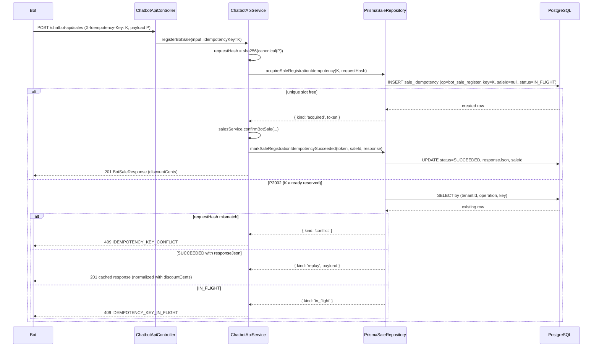
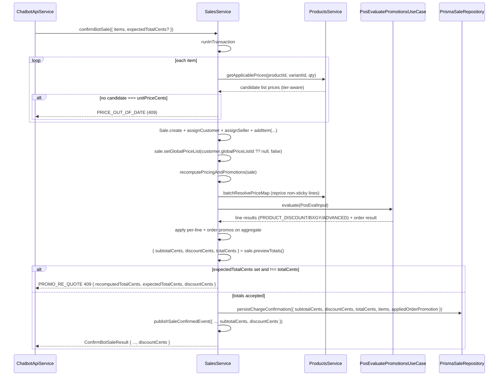
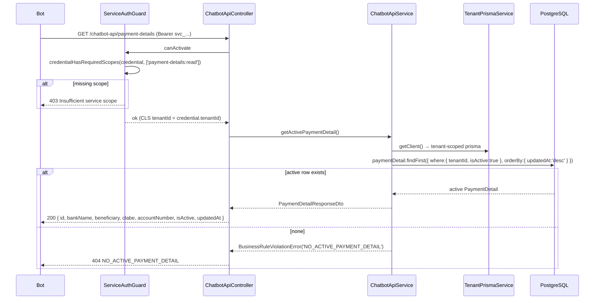

# Design: Chatbot Sale-Flow Blockers (Q1–Q3)

## Technical Approach

This change closes the three blockers that prevent the WhatsApp bot from completing a transfer sale end-to-end:

- **Q1** — Greenfield `PaymentDetail` bounded concept: Prisma model + migration, a new admin CRUD module with granular RBAC (`*:PaymentDetail`), and a read-only `chatbot-api` projection for the bot.
- **Q2** — `confirmBotSale` re-evaluates the bot cart with the real POS promotions engine (`recomputePricingAndPromotions`), computes a real `discountCents = subtotalCents − totalCents`, and surfaces it on the wire + the `sale.confirmed` outbox event. An optional `expectedTotalCents` triggers a `PROMO_RE_QUOTE` rejection on drift.
- **Q3** — `registerBotSale` ports the POS atomic idempotency pattern (`create → P2002 → re-read`) so concurrent same-key requests can never create duplicate sales, and the payload hash distinguishes `replay` / `conflict` / `in_flight`.

The work mirrors existing code exactly: `SaleIdempotency`/`acquireChargeIdempotency` for Q3, the `AdminRoleController`/`AdminRoleService` shape for Q1, and `chargeDraft`'s `recomputePricingAndPromotions` + `sale.previewTotals()` path for Q2.

| Aspect | Decision |
|--------|----------|
| **Q1 entity** | `PaymentDetail` domain entity with `static create()`/`fromPersistence()`, `update()`, `deactivate()` (logical delete). Repository port `IPaymentDetailRepository` + `PAYMENT_DETAIL_REPOSITORY` symbol. |
| **Q1 module** | Nested `src/admin/payment-details/` with its own `AdminPaymentDetailModule` (imports `AuthModule` for guards/ability), imported by `AdminModule`. |
| **Q1 RBAC** | Add `'PaymentDetail'` to `AppSubjects` + 4 `PERMISSION_REGISTRY` entries. `PermissionSeeder` auto-upserts; no role-based restriction beyond CASL. |
| **Q1 bot read** | `GET /chatbot-api/payment-details`, method-level `@RequiredScopes('payment-details:read')` (overrides class default `catalog:read`). Read-only projection via `TenantPrismaService` directly in `ChatbotApiService` (mirrors `getOrderHistoryByPhone`). |
| **Q1 delete** | Logical only: `isActive=false`, never hard delete. List includes inactive rows for audit. |
| **Q2 engine** | Reuse `recomputePricingAndPromotions(sale)` (POS engine), NOT the simplified `evaluate-cart` engine. Totals come from `sale.previewTotals()` — the same single source of truth `chargeDraft` uses. |
| **Q2 price-list binding** | Bind the customer's `globalPriceListId` onto the sale before recompute (mirrors POS `SalesService.assignCustomer` seeding). No list → PUBLICO default fallback. |
| **Q2 re-quote** | Optional `expectedTotalCents`; mismatch → `PROMO_RE_QUOTE` 409 with `{ recomputedTotalCents, expectedTotalCents, discountCents }`. |
| **Q2 error surface** | Extend `BusinessRuleViolationError` with optional `details`; `DomainExceptionFilter` spreads `details` into the body and maps new codes. |
| **Q3 idempotency** | New `acquireSaleRegistrationIdempotency(key, requestHash)` + `markSaleRegistrationIdempotencySucceeded(...)`, delegating to the existing private `acquireIdempotency` helper (widened to `operation='bot_sale_register'`, `saleId: null`). |
| **Q3 hash** | `SHA-256(JSON.stringify(canonicalPayload))` over `{ cashierUserId, customerId, shippingAddressId, items[] }`, items sorted by `(productId, variantId)`. |
| **Q3 failure marking** | None — `FAILED` stays dead. Orphaned `IN_FLIGHT` slots are an accepted operational risk (manual cleanup). |

## Architecture Decisions

### D1 — Q1 lives in a nested `src/admin/payment-details/` module imported by `AdminModule`

The existing admin layer is flat (`admin-role.controller.ts`, `admin-role.service.ts`, shared `dto/`), but `PaymentDetail` is a real hexagonal bounded concept (domain entity + repository port + Prisma adapter + controller + service + DTOs). A nested module keeps the port/adapter wiring self-contained and mirrors the repository injection pattern used elsewhere (`ROLE_REPOSITORY` / `PERMISSION_REPOSITORY`). `AdminModule` only adds one import; `AdminPaymentDetailModule` imports `AuthModule` itself (which exports `JwtAuthGuard`, `PermissionsGuard`, `CaslAbilityFactory`, and the repository tokens), so guard resolution works without making `AuthModule` global.

**Rationale:** minimal blast radius on the existing flat admin module while preserving hexagonal structure; the proposal and specs explicitly reference `src/admin/payment-details/` paths.

### D2 — `PaymentDetail` delete is logical; "active" = newest active row by `updatedAt`

`DELETE /admin/payment-details/:id` sets `isActive=false` and returns 204; the row is retained. `GET /chatbot-api/payment-details` returns the single active account ordered `updatedAt DESC`. This satisfies the spec's audit requirement (list includes inactive rows) and keeps history without a hard-delete endpoint. Multiple active rows are possible only by data inconsistency; the admin should deactivate the old account before activating a new one (documented operational constraint, not DB-enforced — see Risks).

**Rationale:** bank accounts are financial references; soft delete preserves an auditable trail and avoids dangling `SalePayment.reference` ambiguity, while the bot only ever needs the current account.

### D3 — `payment-details:read` needs no guard/model change; only the decorator + runtime grant

`ServiceAuthGuard` enforces scopes via `credentialHasRequiredScopes(credential, requiredScopes)`, which is `requiredScopes.every(scope => credential.hasScope(scope))`; `ServiceCredential.hasScope` is an exact string membership check over `scopes: string[]`. There is **no** allowlist, enum, or validation on scope values anywhere (`ServiceCredential.create` only trims/filters and requires non-empty). Therefore:

- No change to `ServiceCredential`, `ServiceAuthGuard`, or the Prisma model is required to "register" the new scope.
- The only code change is `@RequiredScopes('payment-details:read')` on the new route.
- The credential must be **granted** that scope at runtime (existing credential provisioning / seed / DB update), otherwise the guard returns `403 Insufficient service scope`.

The new route must use method-level `@RequiredScopes`, because the controller class has `@RequiredScopes('catalog:read')` and the guard uses `getAllAndOverride` — method scopes **replace** the class default, not merge.

### D4 — Q2 totals come from `sale.previewTotals()`, not a hand-rolled `originalPriceCents` sum

The specs phrase `subtotalCents = Σ(item.originalPriceCents · quantity)`, but in the actual domain `SaleItem.originalPriceCents` is only snapshotted by `overridePrice` (explicit overrides); `addItem` and `reprice` leave it `null`, and per-line promo discounts store their baseline in `prePriceCentsBeforeDiscount`. `Sale.previewTotals()` is the single source of truth used by `chargeDraft` (`sales.service.ts:2367`): `subtotalCents = Σ((prePriceCentsBeforeDiscount ?? unitPriceCents) · qty)`, then clamps and derives `discountCents = subtotalCents − totalCents` (covering per-line + order-level savings, including BXGY/ADVANCED reward lines).

**Rationale:** using `previewTotals()` makes the bot-sale totals byte-identical to the POS charge path and correctly handles ORDER_DISCOUNT, BXGY, and ADVANCED rewards. A literal `originalPriceCents` sum would yield `0` for bot sales. The design treats the spec's `originalPriceCents` wording as the pre-promo baseline, implemented as `previewTotals()`.

### D5 — Q2 binds the customer's default price list before recompute

The bot sends a flat `unitPriceCents`. `confirmBotSale` currently calls the entity's `Sale.assignCustomer()` which only sets `customerId`/`shippingAddressId`; it does **not** seed `globalPriceListId`. Without binding, `recomputePricingAndPromotions` → `repriceNonStickyLines` falls back to the PUBLICO default list and would re-quote non-sticky lines against a list the bot may not have quoted, silently changing the customer's price.

Fix: after `sale.assignCustomer(...)`, read the customer's `globalPriceListId` and call `sale.setGlobalPriceList(customerListId ?? null, false)` — the same auto-seed the POS `SalesService.assignCustomer` service method performs (`sales.service.ts:1913-1920`). When the customer has no list, `repriceNonStickyLines` falls back to PUBLICO (`resolveDefaultGlobalPriceListId()`).

**Interaction with `getApplicablePrices`:** the existing `PRICE_OUT_OF_DATE` guard checks membership in **any** applicable list (all lists, tier-aware), not specifically the customer's list. Binding the customer's list makes the engine reprice deterministic. If the bot quoted a different list, `expectedTotalCents` (recommended) surfaces the drift as `PROMO_RE_QUOTE`; without `expectedTotalCents`, the server is still the source of truth and persists the engine result.

**Rationale:** reprice is what makes tier-aware and list-gated promotions correct, and it is exactly what the POS charge path already does. Skipping reprice would diverge bot sales from POS behavior and allow stale/list-mismatched prices.

### D6 — `PRICE_OUT_OF_DATE` keeps its existing 409 mapping (not 400)

`DomainExceptionFilter.getHttpStatus` already maps `PRICE_OUT_OF_DATE → 409 CONFLICT`. The proposal's edge-case prose says "400", but the spec only mandates the code `PRICE_OUT_OF_DATE`, and the existing bot contract already observes 409. Changing to 400 would break the current client.

**Rationale:** preserve the shipped contract; the spec is code-agnostic on the status, and the existing filter is the authority.

### D7 — `PROMO_RE_QUOTE`, `NO_ACTIVE_PAYMENT_DETAIL`, `DUPLICATE_CLABE` need explicit filter mappings + error details

`BusinessRuleViolationError` currently has `(message, code)` only and maps to 422. The spec requires:

- `PROMO_RE_QUOTE` → 409 with body `{ recomputedTotalCents, expectedTotalCents, discountCents }`.
- `NO_ACTIVE_PAYMENT_DETAIL` → 404.
- `DUPLICATE_CLABE` → 409.

Plan (additive, backward-compatible):

1. Add optional `details?: Record<string, unknown>` to `BusinessRuleViolationError` (third constructor arg).
2. In `DomainExceptionFilter.catch`, spread `exception.details` into the response body when present.
3. Add explicit mappings in `getHttpStatus`: `PROMO_RE_QUOTE → 409`, `NO_ACTIVE_PAYMENT_DETAIL → 404`, `DUPLICATE_CLABE → 409`.

`IDEMPOTENCY_KEY_CONFLICT` and `IDEMPOTENCY_KEY_IN_FLIGHT` are **already** mapped to 409 — no filter change for Q3.

**Rationale:** the filter is the framework-agnostic HTTP bridge; adding a generic `details` field mirrors the existing `BatchDeleteValidationError.offendingIds` precedent but generalizes it for any error payload.

### D8 — Q3 acquires idempotency without a `saleId`

POS `acquireChargeIdempotency(saleId, key, requestHash)` binds the idempotency row to an existing draft sale. Bot registration has no sale id until `confirmBotSale` runs, so the new port signature is `acquireSaleRegistrationIdempotency(key, requestHash)` and the `saleId` column is written `null` at acquire, then filled by `markSaleRegistrationIdempotencySucceeded(token, saleId, payload)`.

Implementation reuses the existing private helper rather than duplicating P2002 logic a fourth time:

- Widen `acquireIdempotency(operation, saleId, key, requestHash)` to accept `operation: 'sale_charge' | 'sale_payment' | 'sale_cancel' | 'bot_sale_register'` and `saleId: string | null`.
- Add two thin public methods that delegate:
  - `acquireSaleRegistrationIdempotency(key, requestHash)` → `this.acquireIdempotency('bot_sale_register', null, key, requestHash)`
  - `markSaleRegistrationIdempotencySucceeded(token, saleId, payload)` → `this.markIdempotencySucceeded(token, saleId, payload)`

The `SaleIdempotency` model already has `requestHash String` (required) and `@@unique([tenantId, operation, key])`, so no schema change is needed.

### D9 — Q3 canonical `requestHash` is order-independent over a fixed field subset

```typescript
const canonicalPayload = {
  cashierUserId: input.cashierUserId,
  customerId: input.customerId,
  shippingAddressId: input.shippingAddressId ?? null,
  items: [...input.items]
    .map((item) => ({
      productId: item.productId,
      variantId: item.variantId ?? null,
      quantity: item.quantity,
      unitPriceCents: item.unitPriceCents,
    }))
    .sort((a, b) =>
      `${a.productId}|${a.variantId ?? ''}`.localeCompare(
        `${b.productId}|${b.variantId ?? ''}`,
      ),
    ),
};
const requestHash = createHash('sha256')
  .update(JSON.stringify(canonicalPayload))
  .digest('hex');
```

Only the snake_case DTO field names are included; `productName`/`variantName` are excluded so display-name changes never break replay. Sorting before hashing mirrors the POS `sortPaymentsForHash` precedent (`sales.service.ts:312-320`). `JSON.stringify` property order for a literal with string keys is deterministic (insertion order), so this hash is stable.

### D10 — Q3 does not write `FAILED`

The `SaleIdempotencyStatus.FAILED` enum is already dead surface. This cycle does not introduce failure marking: if `confirmBotSale` throws after `acquired`, the slot remains `IN_FLIGHT`. The next acquire for that key returns `in_flight` (matching hash) or `conflict` (mismatched hash). Risk of a permanently-orphaned `IN_FLIGHT` slot is accepted for v1; cleanup is a manual `DELETE` on the row (see Risks).

**Rationale:** failure marking requires a try/catch around `confirmBotSale` plus a `mark…Failed` repository method and a decision on retry semantics — out of scope for the blockers and not required by any spec scenario.

### D11 — Docs drift final count is 11 endpoints (reconciles a spec wording gap)

`PROGRAM-CONTEXT.md` currently documents 9 endpoints; the code has 10 (the missing `POST /chatbot-api/sales/:saleId/cancel`). This change adds `GET /chatbot-api/payment-details`, so the final table has **11** rows (5 GET, 4 POST, 1 PUT, 1 PATCH). The spec's "ten routes total / 9 → 10 entries" wording reflects the pre-new-route correction (9 documented + cancel = 10); adding payment-details makes 11. The design updates the summary table and "Total" line to 11 and flags the spec wording for reconciliation in the delta.

## Data Flow

### Flow 1 — Atomic idempotency acquire (Q3)



### Flow 2 — Engine re-evaluation in `confirmBotSale` (Q2)



### Flow 3 — Bot read endpoint (Q1)



## File Changes

| File | Action | Notes |
|------|--------|-------|
| `prisma/schema.prisma` | Modify | Add `PaymentDetail` model + `PaymentDetail[]` reverse relation on `Tenant`. |
| `prisma/migrations/<ts>_add_payment_detail/` | New | `prisma migrate dev --name add_payment_detail`; forward creates table/index/FK, reverse drops table. |
| `src/auth/authorization/domain/permission.ts` | Modify | `AppSubjects` += `'PaymentDetail'`; `PERMISSION_REGISTRY` += 4 CRUD entries. |
| `src/auth/authorization/infrastructure/permission.seeder.ts` | (no change) | Auto-upserts registry entries on boot — verify via boot smoke test. |
| `src/shared/domain/domain-error.ts` | Modify | `BusinessRuleViolationError` gains optional `details?: Record<string, unknown>`. |
| `src/shared/filters/domain-exception.filter.ts` | Modify | Spread `details` into body; map `PROMO_RE_QUOTE→409`, `NO_ACTIVE_PAYMENT_DETAIL→404`, `DUPLICATE_CLABE→409`. |
| `src/admin/payment-details/domain/payment-detail.entity.ts` | New | Domain entity — `create`/`fromPersistence`, `update`, `deactivate`, field validation (CLABE 18 digits, account ≥10 digits, trimmed non-empty bank/beneficiary). |
| `src/admin/payment-details/domain/payment-detail.repository.ts` | New | `IPaymentDetailRepository` port + `PAYMENT_DETAIL_REPOSITORY` symbol. |
| `src/admin/payment-details/infrastructure/prisma-payment-detail.repository.ts` | New | Prisma adapter; tenant-scoped via `TenantPrismaService`; maps P2002 on `tenantId_clabe` → `DUPLICATE_CLABE`. |
| `src/admin/payment-details/admin-payment-detail.service.ts` | New | CRUD orchestration; `ClsService<TenantClsStore>` tenant scoping; logical delete; `findActive`. |
| `src/admin/payment-details/admin-payment-detail.controller.ts` | New | `@Controller('admin/payment-details')` + `@UseGuards(JwtAuthGuard, TenantContextGuard, PermissionsGuard)` + `@RequirePermissions(['<action>', 'PaymentDetail'])`. |
| `src/admin/payment-details/dto/create-payment-detail.dto.ts` | New | `bankName`, `beneficiary`, `clabe`, `accountNumber` with class-validator. |
| `src/admin/payment-details/dto/update-payment-detail.dto.ts` | New | Partial, optional fields. |
| `src/admin/payment-details/dto/payment-detail-response.dto.ts` | New | Wire projection incl. `id`, `tenantId`, `isActive`, timestamps. |
| `src/admin/payment-details/admin-payment-detail.module.ts` | New | `imports: [AuthModule]`, controller + service + repo provider. |
| `src/admin/admin.module.ts` | Modify | Import `AdminPaymentDetailModule`. |
| `src/sales/domain/sale.repository.ts` | Modify | Add `acquireSaleRegistrationIdempotency` + `markSaleRegistrationIdempotencySucceeded` signatures. |
| `src/sales/infrastructure/prisma-sale.repository.ts` | Modify | Widen `acquireIdempotency` (`bot_sale_register`, `saleId: string|null`); add 2 public delegating methods. |
| `src/sales/sales.service.ts` | Modify | `confirmBotSale` re-evals engine, binds customer list, uses `previewTotals`, accepts `expectedTotalCents`, persists `discountCents` + items + order promo, emits `discountCents`; `publishSaleConfirmedEvent` gains `subtotalCents`/`discountCents`. |
| `src/chatbot-api/application/chatbot-api.service.ts` | Modify | `registerBotSale` builds canonical hash + atomic acquire + branching; `getActivePaymentDetail`; `RegisterBotSaleInput` gains `expectedTotalCents?`. |
| `src/chatbot-api/presentation/chatbot-api.controller.ts` | Modify | New `GET /chatbot-api/payment-details`; pass `expectedTotalCents`; validate idempotency key before service. |
| `src/chatbot-api/presentation/dto/register-bot-sale.request.ts` | Modify | Add `expectedTotalCents?` (`@IsOptional() @IsInt() @Min(0)`). |
| `src/chatbot-api/presentation/dto/bot-sale.response.ts` | Modify | Add `discountCents: number`. |
| `src/chatbot-api/presentation/dto/payment-detail.response.ts` | New | Bot read projection. |
| `openspec/program/whatsapp-ai-chatbot/PROGRAM-CONTEXT.md` | Modify | Endpoint table → 11; add cancel + payment-details sections; §4.3 atomic idempotency; `discountCents` on `BotSaleResponse`; new scope. |
| Test files | New/Modify | `src/admin/payment-details/**/*.spec.ts`, `sales.service.spec.ts`, `chatbot-api.service.spec.ts`, `chatbot-api.controller.spec.ts`, `domain-exception.filter.spec.ts`, `permission.seeder.spec.ts`. |

## Interfaces / Contracts

### Prisma model (Q1)

```prisma
model PaymentDetail {
  id            String   @id @default(uuid())
  tenantId      String
  bankName      String
  beneficiary   String
  clabe         String
  accountNumber String
  isActive      Boolean  @default(true)
  createdAt     DateTime @default(now())
  updatedAt     DateTime @updatedAt

  tenant Tenant @relation(fields: [tenantId], references: [id], onDelete: Cascade)

  @@unique([tenantId, clabe])
  @@index([tenantId])
  @@map("payment_detail")
}
```

`Tenant` gains `paymentDetails PaymentDetail[]`.

Migration forward SQL (shape, generated):

```sql
CREATE TABLE "payment_detail" (
  "id" TEXT NOT NULL,
  "tenantId" TEXT NOT NULL,
  "bankName" TEXT NOT NULL,
  "beneficiary" TEXT NOT NULL,
  "clabe" TEXT NOT NULL,
  "accountNumber" TEXT NOT NULL,
  "isActive" BOOLEAN NOT NULL DEFAULT true,
  "createdAt" TIMESTAMP(3) NOT NULL DEFAULT CURRENT_TIMESTAMP,
  "updatedAt" TIMESTAMP(3) NOT NULL,
  CONSTRAINT "payment_detail_pkey" PRIMARY KEY ("id")
);
CREATE UNIQUE INDEX "payment_detail_tenantId_clabe_key" ON "payment_detail"("tenantId","clabe");
CREATE INDEX "payment_detail_tenantId_idx" ON "payment_detail"("tenantId");
ALTER TABLE "payment_detail" ADD CONSTRAINT "payment_detail_tenantId_fkey"
  FOREIGN KEY ("tenantId") REFERENCES "tenants"("id") ON DELETE CASCADE ON UPDATE CASCADE;
```

Reverse: `DROP TABLE "payment_detail";`.

### RBAC registration (Q1)

```typescript
// AppSubjects
| 'PaymentDetail'

// PERMISSION_REGISTRY
{ subject: 'PaymentDetail', action: 'read',   description: 'View payment details' },
{ subject: 'PaymentDetail', action: 'create', description: 'Create payment details' },
{ subject: 'PaymentDetail', action: 'update', description: 'Update payment details' },
{ subject: 'PaymentDetail', action: 'delete', description: 'Delete (logical) payment details' },
```

### Admin repository port (Q1)

```typescript
export const PAYMENT_DETAIL_REPOSITORY = Symbol('PAYMENT_DETAIL_REPOSITORY');

export interface IPaymentDetailRepository {
  create(paymentDetail: PaymentDetail, tenantId: string): Promise<PaymentDetail>;
  update(paymentDetail: PaymentDetail, tenantId: string): Promise<PaymentDetail>;
  findById(id: string, tenantId: string): Promise<PaymentDetail | null>;
  findAll(tenantId: string): Promise<PaymentDetail[]>;
  findActive(tenantId: string): Promise<PaymentDetail | null>;
}
```

### Bot read response (Q1)

```typescript
export interface PaymentDetailResponseDto {
  id: string;
  bankName: string;
  beneficiary: string;
  clabe: string;
  accountNumber: string;
  isActive: boolean;
  updatedAt: string;
}
```

### Idempotency port additions (Q3)

```typescript
acquireSaleRegistrationIdempotency(
  key: string,
  requestHash: string,
): Promise<
  | { kind: 'acquired'; token: string }
  | { kind: 'replay'; payload: unknown }
  | { kind: 'conflict' }
  | { kind: 'in_flight' }
>;

markSaleRegistrationIdempotencySucceeded(
  token: string,
  saleId: string,
  payload: unknown,
): Promise<void>;
```

### `registerBotSale` branching (Q3)

```typescript
const idempotency = await this.saleRepo.acquireSaleRegistrationIdempotency(
  input.idempotencyKey,
  requestHash,
);

if (idempotency.kind === 'replay') {
  const cached = idempotency.payload as BotSaleResponse;
  // Old cached rows pre-date `discountCents`; normalize additively.
  return { ...cached, discountCents: cached.discountCents ?? 0 };
}
if (idempotency.kind === 'conflict') {
  throw new BusinessRuleViolationError('IDEMPOTENCY_KEY_CONFLICT', 'IDEMPOTENCY_KEY_CONFLICT');
}
if (idempotency.kind === 'in_flight') {
  throw new BusinessRuleViolationError('IDEMPOTENCY_KEY_IN_FLIGHT', 'IDEMPOTENCY_KEY_IN_FLIGHT');
}
// 'acquired' → confirmBotSale → markSaleRegistrationIdempotencySucceeded(token, saleId, response)
```

### Q2 error with details

```typescript
throw new BusinessRuleViolationError(
  'PROMO_RE_QUOTE',
  'PROMO_RE_QUOTE',
  {
    recomputedTotalCents: totalCents,
    expectedTotalCents,
    discountCents,
  },
);
```

`DomainExceptionFilter` then emits:

```json
{
  "statusCode": 409,
  "error": "PROMO_RE_QUOTE",
  "message": "PROMO_RE_QUOTE",
  "timestamp": "…",
  "recomputedTotalCents": 900,
  "expectedTotalCents": 1000,
  "discountCents": 100
}
```

### `BotSaleResponse` (Q2, additive)

```typescript
export interface BotSaleResponse {
  saleId: string;
  folio: string | null;
  paymentStatus: 'CREDIT' | 'PARTIAL' | 'PAID';
  channel: string;
  deliveryStatus: string;
  totalCents: number;
  discountCents: number;   // NEW — 0 when no promo applied
  paidCents: number;
  debtCents: number;
  confirmedAt: string | null;
}
```

## Testing Strategy

| Layer | What | Approach |
|-------|------|----------|
| Unit — entity | `PaymentDetail` validation (CLABE 18 digits, account ≥10 digits, trim, non-empty), `deactivate()`, `update()`, `fromPersistence` round-trip | Table-driven Jest spec. |
| Unit — repository | `PrismaPaymentDetailRepository`: create/update/findById/findAll/findActive tenant scoping, P2002 → `DUPLICATE_CLABE` | Mock `TenantPrismaService`. |
| Unit — admin service | CRUD, cross-tenant 404, logical delete, active selection ordering | Mock repo + CLS store. |
| Unit — controller | Guard + `@RequirePermissions` wiring, 201 create, 204 delete | Mock service; assert decorator metadata where relevant. |
| Unit — idempotency | `acquireSaleRegistrationIdempotency` 4 outcomes; `registerBotSale` replay/conflict/in_flight/acquired; hash order-independence; replay normalization for legacy rows | Mock `ISaleRepository`. |
| Unit — Q2 | `confirmBotSale` no-promo (`discountCents=0`), AUTOMATIC promo, ORDER_DISCOUNT, BXGY/ADVANCED, re-quote match/mismatch, `PRICE_OUT_OF_DATE` guard | Mock `ProductsService`, engine port, repo. |
| Unit — filter | New code mappings + `details` spread | `DomainExceptionFilter` spec. |
| Seeder | 4 new permissions present after boot | Extend `permission.seeder.spec.ts`. |
| Existing regression | `chatbot-api.service.spec.ts:799+` replay tests stay green | No change to replay branch semantics. |

## Threat Matrix

N/A — no routing, shell, subprocess, VCS/PR automation, executable-file classification, or process-integration boundary. The new scope is an exact-match string check on an already-authenticated service credential; no privilege escalation surface is introduced.

## Migration / Rollout

- **Q1**: single additive migration `add_payment_detail` (forward creates `payment_detail` + unique/index/FK; reverse drops the table). Permission registry entries auto-seed on boot (idempotent upsert). No data migration.
- **Q2**: pure code; `discountCents` becomes a real value instead of hardcoded `0`. No schema change. `sale.confirmed` outbox payload gains additive `subtotalCents`/`discountCents` keys.
- **Q3**: pure code; `SaleIdempotency` shape is unchanged (`requestHash` and the unique constraint already exist). Existing `SUCCEEDED` keys replay identically; legacy cached responses are normalized with `discountCents ?? 0`.
- **Rollback** (WU-by-WU, single revert):
  - WU1: `prisma migrate resolve --rolled-back` on `add_payment_detail`; remove the `AdminPaymentDetailModule` import; leave seeded `Permission` rows (inocuous if unassigned), remove `PaymentDetail` from `AppSubjects`/`PERMISSION_REGISTRY` (keep DB rows if any role was already granted them).
  - WU2: revert code; `registerBotSale` returns to the old `upsert`; existing `IN_FLIGHT` rows remain compatible.
  - WU3: revert code + docs; `discountCents` returns to `0`, `expectedTotalCents` ignored, `payment-details` route removed.

## Work Unit Plan

| WU | Scope | Files | Revert boundary |
|----|-------|-------|-----------------|
| WU1 (Q1) | Schema + migration + entity + repo + admin module + RBAC + DTOs + bot read endpoint | `schema.prisma`, migration, `src/admin/payment-details/**`, `admin.module.ts`, `permission.ts`, `domain-error.ts`/`filter.ts`, `chatbot-api.controller.ts` + `chatbot-api.service.ts` + `payment-detail.response.ts`, tests | Reverse migration + remove module import + remove route |
| WU2 (Q3) | Atomic idempotency port + `registerBotSale` refactor + key validation | `sale.repository.ts`, `prisma-sale.repository.ts`, `chatbot-api.service.ts`, `chatbot-api.controller.ts`, tests | Revert code only |
| WU3 (Q2 + docs) | Engine re-eval + `discountCents` + `expectedTotalCents` + outbox + docs drift | `sales.service.ts`, `sale.repository.ts` (result type), `bot-sale.response.ts`, `register-bot-sale.request.ts`, `PROGRAM-CONTEXT.md`, tests | Revert code + docs |

WU2 and WU3 are independent after WU1 and can merge in either order.

## Risks

| Risk | Likelihood | Mitigation |
|------|------------|------------|
| Engine reprice changes the bot-quoted price (surprise to the customer) | Med | Bind customer's default list (D5) + recommend bot always sends `expectedTotalCents`; drift → `PROMO_RE_QUOTE` before any stock/folio side effects. |
| `originalPriceCents`-based spec wording misleads implementers into a `0` subtotal | Med | D4 mandates `sale.previewTotals()`; verify in code review + tests. |
| Multiple active `PaymentDetail` rows (data inconsistency) | Low | Bot returns newest `updatedAt`; operational rule: deactivate old before activating new; not DB-enforced by design. |
| Orphaned `IN_FLIGHT` idempotency slot blocks a key forever | Low | D10: accepted; manual `DELETE` cleanup; no `FAILED` marking this cycle. |
| Legacy cached `BotSaleResponse` lacks `discountCents` on replay | Low | Normalize `{ ...cached, discountCents: cached.discountCents ?? 0 }` in `registerBotSale`. |
| Docs count ambiguity (9 vs 10 vs 11) | Low | D11 fixes final count to 11; update `PROGRAM-CONTEXT.md` summary table + total line in one place. |

## Open Questions

- None — all product decisions are resolved. The only implementation-level choice left to the tasks phase is the exact mechanism for validating the `X-Idempotency-Key` header before DB access (a dedicated header DTO + ValidationPipe, a small `ParseIdempotencyKeyPipe`, or a defensive first-statement check in `registerBotSale`); all must reject empty/missing/`>200` with `400 INVALID_IDEMPOTENCY_KEY` before any DB read.
