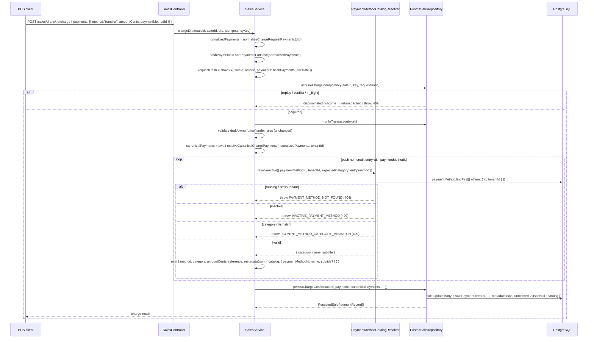
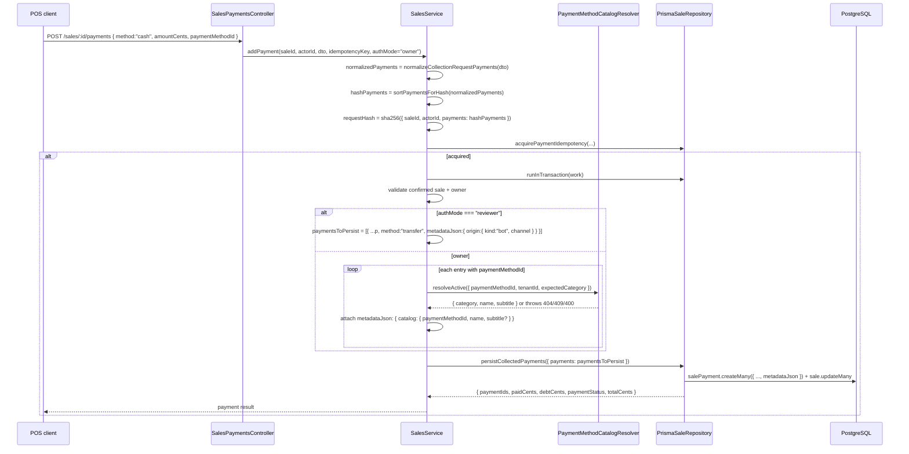
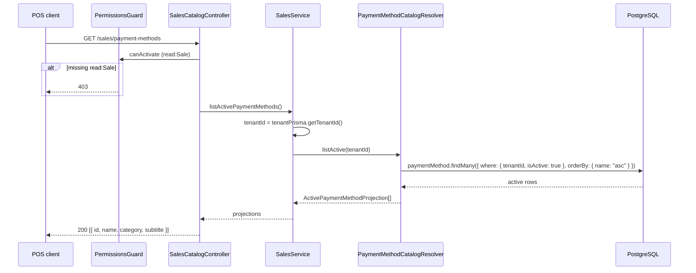

# Design: Custom Payment Methods (POS catalog)

Status: designed (SDD phase — no implementation)

## Technical Approach

This change introduces a tenant-scoped, admin-configurable **payment method catalog** (`PaymentMethod`) that the POS uses as a tender-method selector, plus the charge/add-payment threading that resolves a catalog row into a base `SalePaymentMethod` category and a name/subtitle snapshot in `SalePayment.metadataJson.catalog`. The work mirrors two existing shapes exactly:

- **Q1-shaped module** — the new `src/admin/payment-methods/` module mirrors `src/admin/payment-details/` (domain entity with `static create`/`fromPersistence`, repository port + symbol, tenant-scoped Prisma adapter with P2002/P2025 mapping, DTOs, controller with `@RequirePermissions`, CLS-scoped service, leaf module).
- **POS read surface** — `GET /sales/payment-methods` mirrors `GET /sales/pos-catalog` (`@Controller('sales')` + `@RequirePermissions(['read', 'Sale'])`).

The canonical `SalePaymentMethod` enum is **not** touched. A custom method's persisted `SalePayment.method` stays a base category (`CASH | CARD_CREDIT | CARD_DEBIT | TRANSFER`), and the branded identity lives only in the `metadataJson.catalog` snapshot (`{ paymentMethodId, name, subtitle? }`), under a dedicated key that cannot collide with the existing `reference` (legacy) or `origin` (bot) writers.

| Aspect | Decision |
|--------|----------|
| **Catalog model** | New Prisma `enum PaymentMethodCategory { CASH CARD_CREDIT CARD_DEBIT TRANSFER }` (4 values, **no `CREDIT`**) + `model PaymentMethod` `@@map("payment_methods")`, `@@unique([tenantId, name])`, `@@index([tenantId])`, tenant FK `onDelete: Cascade`, `isActive @default(true)`, optional `subtitle`, optional `metadataJson Json?`. |
| **Module** | New nested `src/admin/payment-methods/` (`AdminPaymentMethodModule`), imported by `AdminModule`. Also exported to `SalesModule` via a narrow read port (`PAYMENT_METHOD_RESOLVER`). |
| **RBAC** | Add `'PaymentMethod'` to `AppSubjects` + 4 `PERMISSION_REGISTRY` entries (`read/create/update/delete`); `PermissionSeeder` auto-upserts on boot. |
| **Tenant isolation** | Add `'PaymentMethod'` to `TENANT_SCOPED_MODELS` (silent allowlist — MUST NOT be omitted) + defense-in-depth `where: { id, tenantId }` in the adapter. |
| **POS projection** | `GET /sales/payment-methods`, `@RequirePermissions(['read', 'Sale'])`, returns active rows as `{ id, name, category, subtitle }`. Lives in `SalesModule` (not admin). |
| **Charge resolution** | `paymentMethodId` threads through `ChargePaymentEntry` → `normalizeChargeRequestPayments` → `sortPaymentsForHash` → async `toCanonicalChargePayments`; resolver validates active + tenant-scoped + category match; snapshot written to `metadataJson.catalog`. |
| **Collection resolution** | `paymentMethodId` threads through `CollectionPaymentEntry` → `normalizeCollectionRequestPayments` → `sortPaymentsForHash` → service-side resolution before `persistCollectedPayments`. |
| **Charge persistence** | `PersistedChargePayment` gains `metadataJson?`; `persistChargeConfirmation` writes `metadataJson` (`undefined → Prisma.JsonNull`, mirroring `persistCollectedPayments`). |
| **Idempotency** | `sortPaymentsForHash` appends `paymentMethodId` **conditionally** so legacy payloads hash byte-identically and two custom methods sharing a category do not collide. |
| **Read model** | `findOneWithRelations` mapper surfaces `paymentMethodId/paymentMethodName/paymentMethodSubtitle` from `metadataJson.catalog`; sale detail, timeline `PAYMENT_RECEIVED`, and receipt PDF prefer the snapshot over the base-category label. |
| **Refunds** | No change — `SalePayment.method` remains a base enum, so `normalizeRefundMethod` keeps working without catalog awareness. |

## Architecture Decisions

### D1 — Catalog lives in a nested `src/admin/payment-methods/` module mirroring `admin/payment-details/`

`PaymentMethod` is a real hexagonal bounded concept (entity + repository port + Prisma adapter + controller + service + DTOs). A nested module keeps the port/adapter wiring self-contained and mirrors the `admin/payment-details/` precedent (D1 of the archived chatbot blockers design). `AdminModule` adds exactly one import; `AdminPaymentMethodModule` imports `AuthModule` itself (which exports `JwtAuthGuard`, `PermissionsGuard`, `CaslAbilityFactory`, and repository tokens), so guard resolution works without making `AuthModule` global.

The module additionally `exports: [PAYMENT_METHOD_RESOLVER]` (D3) so `SalesModule` can consume the narrow read port. The `admin/` prefix reflects the module's primary surface (admin CRUD) and matches the frozen proposal paths; the resolver export is the non-admin seam, not a second module.

**Rationale:** minimal blast radius on the flat admin module while preserving hexagonal structure; the proposal and frozen specs explicitly reference `src/admin/payment-methods/**` and the `PaymentDetail` template.

### D2 — `PaymentMethod` delete is logical; re-activation is a PATCH

`DELETE /admin/payment-methods/:id` sets `isActive=false` and returns 204; the row is retained. Because the spec requires re-activating a deactivated method without recreating it, the entity's `update()` handles `isActive` (unlike `PaymentDetail.update`, which omits it and has no reactivation). `PATCH { isActive: true }` flips a deactivated row back to selectable. The list endpoint returns active + inactive rows ordered `updatedAt DESC` for audit.

**Rationale:** tender methods are referenced by historical `SalePayment.metadataJson.catalog.paymentMethodId`; soft delete preserves an auditable trail while the spec's reactivation scenario is impossible under a create-only lifecycle.

### D3 — Sales resolves catalog rows through a dedicated resolver use-case port (`PAYMENT_METHOD_RESOLVER`), NOT by injecting the repository

**Decision (the required resolver choice):** Option 2 — a dedicated resolver use-case port in the payment-methods module. `SalesService` depends on `IPaymentMethodResolver` (symbol `PAYMENT_METHOD_RESOLVER`), not on `IPaymentMethodRepository`.

The resolver port exposes exactly what sales needs:

```typescript
export const PAYMENT_METHOD_RESOLVER = Symbol('PAYMENT_METHOD_RESOLVER');

export type PaymentMethodCategory = 'cash' | 'card_credit' | 'card_debit' | 'transfer';

export type ResolvedPaymentMethod = {
  category: PaymentMethodCategory;
  name: string;
  subtitle: string | null;
};

export type ActivePaymentMethodProjection = {
  id: string;
  name: string;
  category: PaymentMethodCategory;
  subtitle: string | null;
};

export interface IPaymentMethodResolver {
  /** Resolve an active, tenant-scoped row for a charge/add-payment entry. */
  resolveActive(input: {
    paymentMethodId: string;
    tenantId: string;
    expectedCategory: PaymentMethodCategory;
  }): Promise<ResolvedPaymentMethod>;

  /** Active rows for the POS selector projection. */
  listActive(tenantId: string): Promise<ActivePaymentMethodProjection[]>;
}
```

Why not Option 1 (inject `PAYMENT_METHOD_REPOSITORY` into `SalesModule`/`SalesService`):

- **Coupling.** The repository port exposes `create`/`update` (mutable admin operations) and returns the full entity (`tenantId`, `isActive`, timestamps, `metadataJson`). Sales would depend on a write-capable port and a persistence entity it never mutates. The resolver is a read-only, use-case-shaped contract.
- **Testability.** A one-method `resolveActive` + `listActive` port is a trivial mock in `sales.service.spec.ts`; the repository has five methods and P2002/P2025 semantics that would leak into sales tests.
- **Error ownership.** Not-found/inactive/mismatch validation lives in one place (the resolver) and throws the domain codes the sales spec asserts (`PAYMENT_METHOD_NOT_FOUND`, `INACTIVE_PAYMENT_METHOD`, `PAYMENT_METHOD_CATEGORY_MISMATCH`), instead of being re-implemented in `SalesService`.
- **Tenant scoping.** The resolver's concrete implementation calls `IPaymentMethodRepository.findById(id, tenantId)` / `findAllActive(tenantId)` with an **explicit `tenantId` argument**, and the adapter underneath uses `TenantPrismaService` + `where: { id, tenantId }`. Tenant scoping is never bypassed; the same allowlist entry protects the underlying reads.
- **Precedent.** This mirrors the existing `PromotionsModule`→`SalesModule` Symbol-port seam already documented in `sales.module.ts` ("we import the module to resolve the symbol, but we depend on the I/O contract, not on the engine internals").

The concrete resolver (`PaymentMethodCatalogResolver`) is a thin `@Injectable()` in the payment-methods module, wired under `PAYMENT_METHOD_RESOLVER` and exported. It maps `null → PAYMENT_METHOD_NOT_FOUND`, `isActive === false → INACTIVE_PAYMENT_METHOD`, category mismatch (case-insensitive) → `PAYMENT_METHOD_CATEGORY_MISMATCH`.

### D4 — POS read projection is `GET /sales/payment-methods` in `SalesModule`, not an admin route

**Route choice:** `GET /sales/payment-methods`, added to `SalesCatalogController` (the existing `@Controller('sales')` POS read surface), guarded by `@UseGuards(JwtAuthGuard, TenantContextGuard, PermissionsGuard)` + `@RequirePermissions(['read', 'Sale'])`.

Justification:

- **Permission model.** POS users hold `read:Sale` (the same scope as `GET /sales/pos-catalog`); they do not necessarily hold `read:PaymentMethod` (an admin CRUD scope). Placing the projection under `/sales/*` lets the frontend's existing POS auth token select methods without a new role grant, exactly matching the spec's "mirror `GET /sales/pos-catalog`" constraint.
- **Projection differs from admin.** The admin `GET /admin/payment-methods` returns the full audit projection (`id`, `tenantId`, `name`, `category`, `subtitle`, `isActive`, timestamps) and includes inactive rows. The POS needs a narrower, active-only shape `{ id, name, category, subtitle }` and must not expose `metadataJson`. Two surfaces, two shapes, two permissions.
- **Bounded-context placement.** `SalesCatalogController` already serves `GET /sales/pos-catalog`; the payment-method selector is a second POS read. Keeping it in the sales module avoids coupling the admin CRUD guard set to the POS selector.

Implementation: `SalesCatalogController` gains `@Get('payment-methods')` → `salesService.listActivePaymentMethods()`, which delegates to `paymentMethodResolver.listActive(tenantId)` (tenant id from `this.tenantPrisma.getTenantId()`). The admin CRUD remains entirely under `AdminPaymentMethodController`.

### D5 — Catalog snapshot is stored under the dedicated `metadataJson.catalog` key

`SalePayment.metadataJson` already has two writers (`reference` from legacy rows, `origin` from the bot reviewer path) and one reader (`extractLegacyReference` reads only `.reference`). The new snapshot uses a dedicated top-level key so none of them collide:

```json
{ "catalog": { "paymentMethodId": "<uuid>", "name": "Mercado Pago", "subtitle": "Link" } }
```

`subtitle` is omitted when `null`. `extractLegacyReference` is **not modified** and continues to read only `metadataJson.reference`; the bot `origin` key is untouched. Any future extensibility nests inside `catalog` (or a sibling versioned key), never at top level.

**Rationale:** the explore confirmed the collision risk and recommended the dedicated key; this keeps `reference` fallback and the bot path byte-compatible.

### D6 — The catalog enum excludes `CREDIT` structurally

`PaymentMethodCategory` has exactly four values (`CASH | CARD_CREDIT | CARD_DEBIT | TRANSFER`). `toCanonicalChargePayments` filters `method === 'credit'` (credit is a sale-status marker, never a persisted `SalePayment`). Because a catalog row can never resolve to `credit`, the credit filter can never drop a custom method's row or its snapshot.

**Rationale:** eliminates the "credit trap" risk from the explore (§(c).2) structurally rather than by convention. The legacy "A Crédito" built-in stays a native fixed method and is never a configurable catalog row.

### D7 — Charge path writes `metadataJson` exactly like `persistCollectedPayments`

Today `persistChargeConfirmation` writes no `metadataJson`, while `persistCollectedPayments` does (`undefined → Prisma.JsonNull`). The design adds `metadataJson?: unknown` to `PersistedChargePayment` and to the `salePayment.create` call in `persistChargeConfirmation`:

```typescript
metadataJson:
  payment.metadataJson === undefined
    ? Prisma.JsonNull
    : (payment.metadataJson as Prisma.InputJsonValue),
```

**Rationale:** reuse the proven collection-path serialization so charge and collection snapshots are byte-identical on the wire and `undefined` (legacy charge) still stores `null`.

### D8 — Idempotency hashes include `paymentMethodId` conditionally, preserving legacy hashes

`sortPaymentsForHash` widens its input to `Array<{ method: string; amountCents: number; reference?: string; paymentMethodId?: string }>` and appends `paymentMethodId` to the sort key **only when present**:

```typescript
const key = (p: { method: string; amountCents: number; reference?: string; paymentMethodId?: string }) =>
  `${p.method}|${p.amountCents}|${p.reference ?? ''}${p.paymentMethodId ? `|${p.paymentMethodId}` : ''}`;
```

Two properties make this safe:

1. **Legacy hash preservation.** `JSON.stringify` omits `undefined` fields. A legacy entry has `paymentMethodId: undefined`, so both the sort key (no trailing `|`) and the hashed JSON (`{ method, amountCents, reference }`) are byte-identical to today. The spec's "requests without `paymentMethodId` MUST hash exactly as today" holds.
2. **Collision avoidance.** A custom entry has `paymentMethodId` set, so the sort key gains `|<uuid>` and the hashed JSON gains the field — two custom methods sharing a base category hash differently.

The `addPayment` hash currently strips fields via `.map((p) => ({ method, amountCents, reference }))`; this call is changed to pass `normalizedPayments` directly so `paymentMethodId` survives into the hash (the map today silently drops it). Reviewer mode (bot) has no `paymentMethodId`, so its hash is unchanged.

**Rationale:** satisfies the required idempotency-collision test (same category, different `paymentMethodId`) while keeping the frozen "legacy payloads keep their existing hash" scenario green.

### D9 — New error codes map explicitly in `DomainExceptionFilter`

`BusinessRuleViolationError` already defaults to 422 and `EntityNotFoundError` to 404. The frozen specs assert specific codes/statuses, so `DomainExceptionFilter.getHttpStatus` gains:

```typescript
// ── Custom payment methods ──
if (exception.code === 'PAYMENT_METHOD_NOT_FOUND') return HttpStatus.NOT_FOUND;
if (exception.code === 'INACTIVE_PAYMENT_METHOD') return HttpStatus.CONFLICT;
if (exception.code === 'PAYMENT_METHOD_CATEGORY_MISMATCH') return HttpStatus.BAD_REQUEST;
if (exception.code === 'DUPLICATE_NAME') return HttpStatus.CONFLICT;
```

Admin cross-tenant/not-found uses `EntityNotFoundError('PaymentMethod', id)` (code `ENTITY_NOT_FOUND` → 404), mirroring `PaymentDetail` and the "never 403" rule. The resolver path uses the sales spec codes (`PAYMENT_METHOD_NOT_FOUND` / `INACTIVE_PAYMENT_METHOD` / `PAYMENT_METHOD_CATEGORY_MISMATCH`).

**Rationale:** the filter is the framework-agnostic HTTP bridge; explicit mappings are additive and match the archived design's D7 precedent.

### D10 — Read model propagates the snapshot via `findOneWithRelations`, timeline, and receipt

- `findOneWithRelations` already `select`s `metadataJson: true` on payments. The mapper adds `paymentMethodId`, `paymentMethodName`, `paymentMethodSubtitle` derived from a new `extractCatalogSnapshot(metadataJson)` helper (sibling of `extractLegacyReference`).
- `SaleDetailPaymentDto` gains the three optional fields; `getSaleDetail` spreads them only when non-null (so legacy rows stay absent on the wire, matching the spec's "absent or null").
- `buildSaleTimeline`'s `PAYMENT_RECEIVED` input/event gains `paymentMethodName?` / `paymentMethodSubtitle?`; `getSaleDetail` passes them through.
- The receipt `Payment` interface (in `payments-list.tsx`) gains `paymentMethodName?` / `paymentMethodSubtitle?`; `PdfGenerationService.buildReceiptProps` passes them; `PaymentsList` renders `paymentMethodName ?? formatMethod(method)` and a gray `subtitle` sub-line when present. The base-category label map (`formatMethod`) remains the fallback.

**Rationale:** snapshot-first rendering satisfies the visible-name success criteria with a graceful base-enum fallback for legacy rows, and avoids any join at read time (the snapshot is self-contained).

### D11 — Migration is additive; `SalePaymentMethod` is untouched; no live FK from `sale_payments`

A single additive migration creates `payment_methods` (new enum type + table + index + unique + FK). `SalePaymentMethod` and `sale_payments` are not altered; the catalog `paymentMethodId` in `metadataJson.catalog` is a plain opaque string, not a foreign key. No backfill, no data rewrite.

**Rationale:** keeps the change reversible and avoids any destructive enum delta; historical rows degrade gracefully (no `catalog` key → base enum label).

## Data Flow

### Flow 1 — Charge with a custom method (`POST /sales/drafts/:id/charge`)



### Flow 2 — Add payment to a confirmed sale (`POST /sales/:id/payments`)



### Flow 3 — POS read projection (`GET /sales/payment-methods`)



Admin CRUD (`POST/GET/GET:id/PATCH/DELETE /admin/payment-methods`) follows the `PaymentDetail` flow verbatim (guard → CLS tenant → entity mutation → repository), with P2002 → `DUPLICATE_NAME` (409) and P2025/`EntityNotFoundError` → 404; it is not re-diagrammed because it is a structural clone of an already-documented flow.

## File Changes

| File | Action | Notes |
|------|--------|-------|
| `prisma/schema.prisma` | Modify | Add `enum PaymentMethodCategory` (4 values, no CREDIT) + `model PaymentMethod` `@@map("payment_methods")`; `Tenant` gains `paymentMethods PaymentMethod[]`. `SalePaymentMethod` unchanged. |
| `prisma/migrations/<ts>_add_payment_methods/migration.sql` | New | Additive: `CREATE TYPE` + `CREATE TABLE "payment_methods"` + tenant index + `@@unique([tenantId, name])` index + FK cascade. |
| `src/shared/tenant/tenant-scoped-models.constant.ts` | Modify | Add `'PaymentMethod'` after `'PaymentDetail'` (silent allowlist — MUST NOT be omitted). |
| `src/auth/authorization/domain/permission.ts` | Modify | `AppSubjects` += `'PaymentMethod'`; `PERMISSION_REGISTRY` += 4 CRUD entries (descriptions per spec). |
| `src/shared/filters/domain-exception.filter.ts` | Modify | Map `PAYMENT_METHOD_NOT_FOUND→404`, `INACTIVE_PAYMENT_METHOD→409`, `PAYMENT_METHOD_CATEGORY_MISMATCH→400`, `DUPLICATE_NAME→409`. |
| `src/admin/admin.module.ts` | Modify | Import `AdminPaymentMethodModule`. |
| `src/admin/payment-methods/domain/payment-method.entity.ts` | New | `PaymentMethod` aggregate: `create`/`fromPersistence`, `update` (incl. `isActive`), `deactivate`, `toResponse`/`toPersistence`, `sanitizeName` (1..60), `sanitizeSubtitle` (0..120), category guard (4 values). |
| `src/admin/payment-methods/domain/payment-method.repository.ts` | New | `IPaymentMethodRepository` (`create/update/findById/findAll/findAllActive`) + `PAYMENT_METHOD_REPOSITORY` symbol. |
| `src/admin/payment-methods/domain/payment-method.resolver.ts` | New | `IPaymentMethodResolver` + `PAYMENT_METHOD_RESOLVER` symbol + `ResolvedPaymentMethod`/`ActivePaymentMethodProjection` types (D3). |
| `src/admin/payment-methods/payment-method-catalog.resolver.ts` | New | Thin `@Injectable()` implementing `IPaymentMethodResolver` over the repository; throws the three sales-spec domain codes. |
| `src/admin/payment-methods/infrastructure/prisma-payment-method.repository.ts` | New | Prisma adapter, tenant-scoped via `TenantPrismaService`, explicit `where: { id, tenantId }`; P2002 → `DUPLICATE_NAME`, P2025 → `EntityNotFoundError`; coerces enum case. |
| `src/admin/payment-methods/dto/create-payment-method.dto.ts` | New | `name` (1..60), `category` (`@IsIn` 4 values), `subtitle?` (≤120). |
| `src/admin/payment-methods/dto/update-payment-method.dto.ts` | New | Partial: `name/category/subtitle/isActive`. |
| `src/admin/payment-methods/dto/payment-method-response.dto.ts` | New | `{ id, tenantId, name, category, subtitle, isActive, createdAt, updatedAt }`. |
| `src/admin/payment-methods/admin-payment-method.controller.ts` | New | `@Controller('admin/payment-methods')` + guards + `@RequirePermissions([action, 'PaymentMethod'])`; DELETE logical (204). |
| `src/admin/payment-methods/admin-payment-method.service.ts` | New | CLS tenant resolution, `randomUUID`, partial update, logical delete. |
| `src/admin/payment-methods/admin-payment-method.module.ts` | New | `imports: [AuthModule]`, controller + service + repo provider + resolver provider; `exports: [PAYMENT_METHOD_RESOLVER]`. |
| `src/sales/sales.module.ts` | Modify | Import `AdminPaymentMethodModule` (to resolve `PAYMENT_METHOD_RESOLVER`). |
| `src/sales/domain/sale.repository.ts` | Modify | `PersistedChargePayment` gains `metadataJson?`; `findOneWithRelations` payments array gains `paymentMethodId/paymentMethodName/paymentMethodSubtitle: string | null`. |
| `src/sales/infrastructure/prisma-sale.repository.ts` | Modify | `persistChargeConfirmation` writes `metadataJson`; add `extractCatalogSnapshot`; `findOneWithRelations` mapper surfaces catalog fields. `extractLegacyReference` unchanged. |
| `src/sales/sales.service.ts` | Modify | Types gain `paymentMethodId?`; `normalize*` copy it; `sortPaymentsForHash` conditional key; async charge resolution; collection resolution; `listActivePaymentMethods`; `getSaleDetail` maps catalog fields + timeline. |
| `src/sales/dto/charge-sale.dto.ts` | Modify | `ChargePaymentEntryDto` + `ChargeSaleDto` gain optional `@IsOptional() @IsUUID() paymentMethodId`. |
| `src/sales/dto/add-sale-payment.dto.ts` | Modify | `AddSalePaymentEntryDto` + `AddSalePaymentDto` gain optional `@IsOptional() @IsUUID() paymentMethodId`. |
| `src/sales/dto/sale-detail-response.dto.ts` | Modify | `SaleDetailPaymentDto` gains `paymentMethodId?/paymentMethodName?/paymentMethodSubtitle?`; `PAYMENT_RECEIVED` event gains `paymentMethodName?/paymentMethodSubtitle?`. |
| `src/sales/domain/build-sale-timeline.ts` | Modify | `PAYMENT_RECEIVED` input/event carry `paymentMethodName?`/`paymentMethodSubtitle?`. |
| `src/sales/sales-catalog.controller.ts` | Modify | Add `@Get('payment-methods')` + `@RequirePermissions(['read', 'Sale'])`. |
| `src/pdf-generation/pdf-generation.service.ts` | Modify | `buildReceiptProps` passes `paymentMethodName/paymentMethodSubtitle` into `Payment[]`. |
| `src/pdf-generation/templates/shared/payments-list.tsx` | Modify | `Payment` gains optional name/subtitle; render `paymentMethodName ?? formatMethod(method)` + subtitle sub-line. |
| Test files | New/Modify | `src/admin/payment-methods/**/*.spec.ts`; `sales.service.spec.ts`; `prisma-sale.repository.spec.ts`; `build-sale-timeline.spec.ts`; `payments-list.spec.tsx`; `permission.seeder.spec.ts`. |

## Interfaces / Contracts

### Prisma model

```prisma
enum PaymentMethodCategory {
  CASH
  CARD_CREDIT
  CARD_DEBIT
  TRANSFER
}

model PaymentMethod {
  id           String                 @id @default(uuid())
  tenantId     String
  name         String
  category     PaymentMethodCategory
  subtitle     String?
  isActive     Boolean                @default(true)
  metadataJson Json?
  createdAt    DateTime               @default(now())
  updatedAt    DateTime               @updatedAt

  tenant Tenant @relation(fields: [tenantId], references: [id], onDelete: Cascade)

  @@unique([tenantId, name])
  @@index([tenantId])
  @@map("payment_methods")
}
```

Migration forward SQL (shape, generated):

```sql
CREATE TYPE "PaymentMethodCategory" AS ENUM ('CASH', 'CARD_CREDIT', 'CARD_DEBIT', 'TRANSFER');

CREATE TABLE "payment_methods" (
    "id" TEXT NOT NULL,
    "tenantId" TEXT NOT NULL,
    "name" TEXT NOT NULL,
    "category" "PaymentMethodCategory" NOT NULL,
    "subtitle" TEXT,
    "isActive" BOOLEAN NOT NULL DEFAULT true,
    "metadataJson" JSONB,
    "createdAt" TIMESTAMP(3) NOT NULL DEFAULT CURRENT_TIMESTAMP,
    "updatedAt" TIMESTAMP(3) NOT NULL,
    CONSTRAINT "payment_methods_pkey" PRIMARY KEY ("id")
);

CREATE INDEX "payment_methods_tenantId_idx" ON "payment_methods"("tenantId");
CREATE UNIQUE INDEX "payment_methods_tenantId_name_key" ON "payment_methods"("tenantId", "name");
ALTER TABLE "payment_methods" ADD CONSTRAINT "payment_methods_tenantId_fkey"
  FOREIGN KEY ("tenantId") REFERENCES "tenants"("id") ON DELETE CASCADE ON UPDATE CASCADE;
```

Reverse: `DROP TABLE "payment_methods"; DROP TYPE "PaymentMethodCategory";`.

### Repository port

```typescript
export const PAYMENT_METHOD_REPOSITORY = Symbol('PAYMENT_METHOD_REPOSITORY');

export interface IPaymentMethodRepository {
  create(paymentMethod: PaymentMethod): Promise<PaymentMethod>;
  update(paymentMethod: PaymentMethod): Promise<PaymentMethod>;
  findById(id: string, tenantId: string): Promise<PaymentMethod | null>;
  findAll(tenantId: string): Promise<PaymentMethod[]>;          // active + inactive, updatedAt DESC
  findAllActive(tenantId: string): Promise<PaymentMethod[]>;     // active only, for POS projection
}
```

### Resolver port (D3)

See the `IPaymentMethodResolver` snippet in D3. Errors: `PAYMENT_METHOD_NOT_FOUND` (null/cross-tenant), `INACTIVE_PAYMENT_METHOD` (`isActive === false`), `PAYMENT_METHOD_CATEGORY_MISMATCH` (`expectedCategory.toLowerCase() !== resolved.category`).

### Domain entity (shape)

```typescript
export interface PaymentMethodProps {
  id: string; tenantId: string; name: string;
  category: PaymentMethodCategory; subtitle: string | null;
  isActive: boolean; metadataJson: Record<string, unknown> | null;
  createdAt: Date; updatedAt: Date;
}

export interface CreatePaymentMethodInput {
  id: string; tenantId: string; name: string;
  category: PaymentMethodCategory; subtitle?: string | null;
}

export interface UpdatePaymentMethodInput {
  name?: string; category?: PaymentMethodCategory;
  subtitle?: string | null; isActive?: boolean;
}

class PaymentMethod {
  static create(input): PaymentMethod;          // validates + defaults isActive=true, metadataJson=null
  static fromPersistence(props): PaymentMethod; // skips validation
  update(input): PaymentMethod;                 // partial, incl. isActive (reactivation), bumps updatedAt
  deactivate(): PaymentMethod;                  // logical delete (idempotent)
  toResponse(): PaymentMethodResponseDto;
  toPersistence(): { ...; category: 'CASH' | 'CARD_CREDIT' | 'CARD_DEBIT' | 'TRANSFER'; metadataJson: ... | null };
}
```

### Validation DTOs

`create-payment-method.dto.ts` (update is the same fields, all `@IsOptional()`):

```typescript
export class CreatePaymentMethodDto {
  @IsString({ message: 'INVALID_NAME' })
  @IsNotEmpty({ message: 'INVALID_NAME' })
  @MaxLength(60, { message: 'NAME_TOO_LONG' })
  @Matches(/\S/, { message: 'INVALID_NAME' })
  name!: string;

  @IsIn(['cash', 'card_credit', 'card_debit', 'transfer'], { message: 'INVALID_CATEGORY' })
  category!: PaymentMethodCategory;

  @IsOptional()
  @IsString({ message: 'INVALID_SUBTITLE' })
  @MaxLength(120, { message: 'SUBTITLE_TOO_LONG' })
  subtitle?: string;
}
```

`UpdatePaymentMethodDto` additionally has `@IsOptional() @IsBoolean() isActive?: boolean`.

### `SalePayment.metadataJson.catalog` contract

```jsonc
// present only when a charge/add-payment entry carried paymentMethodId
{ "catalog": { "paymentMethodId": "<uuid>", "name": "Mercado Pago", "subtitle": "Link" } }
// subtitle omitted when null; legacy entries carry no `catalog` key at all
```

### Sale detail / timeline additions

```typescript
interface SaleDetailPaymentDto {
  // ...existing fields...
  paymentMethodId?: string;
  paymentMethodName?: string;
  paymentMethodSubtitle?: string;
}
// PAYMENT_RECEIVED event additionally: paymentMethodName?: string; paymentMethodSubtitle?: string;
```

### Receipt `Payment` addition

```typescript
export interface Payment {
  method: string;
  amountCents: number;
  reference?: string | null;
  paidAt?: string | null;
  paymentMethodName?: string | null;    // NEW — preferred label
  paymentMethodSubtitle?: string | null; // NEW — gray sub-line when present
}
```

## Testing Strategy

| Layer | What | Approach |
|-------|------|----------|
| Unit — entity | `sanitizeName` (empty/whitespace/61-char → error), `sanitizeSubtitle` (null ok, 121 → error), category guard (credit/CRYPTO rejected), `create` defaults, `update` partial incl. `isActive` reactivation, `deactivate` idempotent, `fromPersistence` round-trip + enum-case coercion | Table-driven Jest spec. |
| Unit — repository | `PrismaPaymentMethodRepository`: create/update/findById/findAll/findAllActive tenant scoping, P2002 → `DUPLICATE_NAME`, P2025 → `EntityNotFoundError` | Mock `TenantPrismaService`. |
| Unit — resolver | `resolveActive` not-found/inactive/mismatch/success; `listActive` active-only + projection | Mock `IPaymentMethodRepository`. |
| Unit — admin service/controller | CRUD, cross-tenant 404, logical delete 204, reactivation PATCH, `@RequirePermissions` wiring | Mock repo + CLS store. |
| Unit — sales charge threading | `normalizeChargeRequestPayments` copies `paymentMethodId` in both branches; `toCanonicalChargePayments` resolves + snapshots; `metadataJson.catalog` shape; mismatch/inactive/foreign-tenant rejection; legacy entry has no `catalog` key | Mock resolver + repo. |
| **Unit — idempotency (REQUIRED)** | Same category + same amount + different `paymentMethodId` produce distinct hashes; identical custom payload replays; legacy payload hash byte-identical | Assert `sha256` input / sort output. |
| Unit — collection threading | `addPayment` owner mode resolves + snapshots; reviewer mode unaffected (origin only); hash includes `paymentMethodId` | Mock resolver + repo. |
| Unit — read model | `findOneWithRelations` mapper surfaces catalog fields; legacy row → nulls; `getSaleDetail` omits absent fields; timeline `PAYMENT_RECEIVED` carries name | Mock repo. |
| Unit — PDF | `PaymentsList` prefers `paymentMethodName`, renders subtitle sub-line, falls back to `formatMethod` | Extend `payments-list.spec.tsx` snapshot. |
| Seeder | 4 new `PaymentMethod` permissions present after boot | Extend `permission.seeder.spec.ts`. |
| Optional integration | `*.integration.spec.ts` for the Prisma adapter | Follow existing integration config if present. |

## Threat Matrix

N/A — no routing, shell, subprocess, VCS/PR automation, executable-file classification, or process-integration boundary. The new surface is admin CRUD + a POS read projection guarded by the existing `JwtAuthGuard`/`TenantContextGuard`/`PermissionsGuard`, and a read-only resolver behind an explicit `tenantId` argument. The tenant allowlist (`TENANT_SCOPED_MODELS`) is the only cross-tenant escalation risk and is called out as a checklist item in D1/specs/tasks.

## Migration / Rollout

- **Migration.** Single additive migration `add_payment_methods` (`prisma migrate dev --name add_payment_methods`); forward creates enum + table + indices + FK, reverse drops them. No `SalePaymentMethod` change, no column alteration, no data backfill. A dedicated `prisma/migrations/<ts>_add_payment_methods/` folder **is** required (mirrors `20260824225358_add_payment_detail`).
- **RBAC/tenant plumbing.** Permission registry entries auto-seed on boot (idempotent upsert). `'PaymentMethod'` in `TENANT_SCOPED_MODELS` activates auto tenant injection.
- **Rollout order (single WU, single revert).** Code + migration deploy together: schema first (`migrate deploy`), then module wiring, DTO/sales threading, POS projection, and PDF label change. Old clients are unaffected (legacy payloads hash and persist identically); the new backend accepts old payloads unchanged.
- **Rollback.** Revert the module wiring, DTO fields, sales-service threading, POS endpoint, and PDF change in one commit. The `payment_methods` table is purely additive; full removal is a follow-up additive `DROP TABLE "payment_methods"` (only after confirming no tenant relies on it). Rows already written with `metadataJson.catalog` are harmless (old code ignores the key; `extractLegacyReference` reads only `.reference`). Verify with `pnpm test` + `pnpm build`, then smoke-test a legacy charge and a refund of a previously custom-method payment.

## Work Unit Plan

| WU | Scope | Revert boundary |
|----|-------|-----------------|
| WU1 | Schema + migration + entity + repo + resolver + admin module + RBAC + tenant allowlist + DTOs + error mappings | Reverse migration + remove module import + remove permission/allowlist entries |
| WU2 | Sales charge/collection threading + idempotency + read model + POS projection + PDF label | Revert code only (schema already deployed in WU1) |

WU2 depends on WU1 (needs the resolver token + model). The two WUs can merge in one PR; the split is purely for revert clarity.

## Risks

| Risk | Likelihood | Mitigation |
|------|------------|------------|
| Idempotency collision (two custom methods, same category) | Med | D8 conditional hash key; required collision test. |
| Tenant allowlist omission re-enables cross-tenant reads | Med | Explicit `'PaymentMethod'` checklist item in specs/tasks + `where: { id, tenantId }` defense in depth. |
| `credit`-category catalog row silently dropped | Low (structurally impossible) | D6: enum excludes `CREDIT`; filter only drops `method==='credit'` inputs. |
| Charge path `metadataJson` omitted (receipt/detail show base label) | Low | D7 mirrors `persistCollectedPayments`; covered by read-model + PDF tests. |
| Legacy hash drift from adding the field | Low | D8 relies on `JSON.stringify` omitting `undefined`; explicit legacy-hash regression test. |
| Historical snapshot staleness after rename/deactivate | Accepted | Snapshot semantics (frozen spec); no backfill, no live FK. |
| Cross-module import of `AdminPaymentMethodModule` from `SalesModule` feels unusual | Low | Narrow `PAYMENT_METHOD_RESOLVER` export (D3); mirrors the `PromotionsModule` Symbol-port precedent. |

## Open Questions

- None — all product decisions are resolved in the proposal and frozen specs. The only implementation-level choices left to the tasks phase are (a) whether the POS projection order is `name ASC` (recommended) or `updatedAt DESC`, and (b) whether the optional Prisma-adapter integration spec follows the existing integration harness or is deferred — neither changes the contract.
