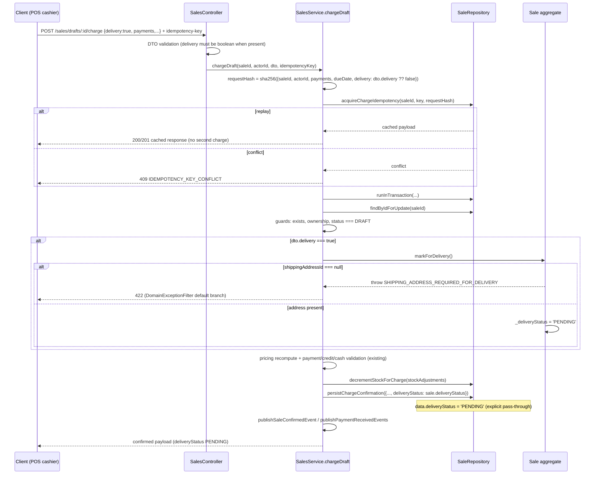

# Design: POS sale "for delivery" at charge time (`pos-sale-delivery`)

This change lets a POS cashier flag a sale **for delivery** at charge time. The confirmed sale becomes `deliveryStatus: 'PENDING'` (instead of inheriting the draft's `'DELIVERED'`) and therefore passes `DeliveryRoute.create`/`addStop` eligibility. The implementation is a small domain mutation plus a pass-through of the already-loaded field into the existing charge confirmation — **no schema, migration, repository-signature, or authorization changes**.

## Decision summary

| Topic | Decision |
|-------|----------|
| Flag shape | `@IsOptional() @IsBoolean() delivery?: boolean` on `ChargeSaleDto` |
| Guard location | New domain method `Sale.markForDelivery()` (mirrors `setShippingAddress`/`markDelivered`) |
| Guard semantics | `ensureDraft()`; throw 422 `SHIPPING_ADDRESS_REQUIRED_FOR_DELIVERY` when `shippingAddressId === null`; else set `_deliveryStatus = 'PENDING'` |
| Persistence | `chargeDraft` passes `deliveryStatus: sale.deliveryStatus` explicitly to `persistChargeConfirmation` |
| Idempotency | Add `delivery: dto.delivery ?? false` to the charge `requestHash` |
| Authorization | Reuse `update:Sale`; no CASL/registry/seeding change |
| Repository | No signature change; `PENDING` already in both union types |
| `SHIPPED`-union mismatch | Defer (document only); not blocking for `PENDING` |

## Architecture decisions

### ADR-1 — Domain method `Sale.markForDelivery()` (not an inline guard in `chargeDraft`)

**Decision.** Add a draft-only aggregate mutation `Sale.markForDelivery()` rather than inlining the shipping-address guard + status assignment in `sales.service.ts`.

**Rationale.** The codebase already centralizes delivery-state and draft-only transitions in the `Sale` aggregate: `setShippingAddress` guards `ensureDraft()` plus a customer/address invariant (`sale.entity.ts:716-727`), and `markDelivered` owns the `PENDING/DELIVERED` flip with its own transition guard (`sale.entity.ts:676-689`). `ensureDraft()` is already private and reusable (`sale.entity.ts:729-733`). Putting the new guard on the aggregate means `PrismaSaleRepository.save` (`prisma-sale.repository.ts:108`) and every future charge-like writer inherit the same invariant, and `chargeDraft` stays policy-free.

**Alternatives considered.**

- *Inline guard in `chargeDraft`* — fewer lines, but scatters delivery policy into the service, diverges from the `setShippingAddress`/`markDelivered` precedent, and would need to be re-implemented by any future writer of a charge confirmation.
- *Only pass `deliveryStatus` to `persistChargeConfirmation` without a domain guard* — would still satisfy the happy path but would not throw the dedicated domain error from a single reusable place.

**Consequences.** A new public method on `Sale`; unit tests in `sale.entity.spec.ts` near `setShippingAddress` (`:645`) and `markDelivered`. `chargeDraft` calls it once when `dto.delivery === true`.

Contract (place after `setShippingAddress`, `sale.entity.ts:727`):

```ts
markForDelivery(): void {
  this.ensureDraft();
  if (this._shippingAddressId === null) {
    throw new BusinessRuleViolationError(
      'SHIPPING_ADDRESS_REQUIRED_FOR_DELIVERY',
      'SHIPPING_ADDRESS_REQUIRED_FOR_DELIVERY',
    );
  }
  this._deliveryStatus = 'PENDING';
}
```

`BusinessRuleViolationError` is already imported at `sale.entity.ts:1-4`.

### ADR-2 — Explicit `deliveryStatus` pass-through to `persistChargeConfirmation`

**Decision.** `chargeDraft` passes `deliveryStatus: sale.deliveryStatus` explicitly in the `persistChargeConfirmation` input (`sales.service.ts:2605-2636`). After `markForDelivery()` this is `'PENDING'` when flagged, and remains the draft's seeded `'DELIVERED'` otherwise.

**Rationale.** `persistChargeConfirmation` builds its update payload conditionally and only writes fields the caller explicitly provided (`prisma-sale.repository.ts:946-947`). Relying on the conditional-write omission would keep the draft's `'DELIVERED'` and the feature would never work. Reading `sale.deliveryStatus` (rather than computing `dto.delivery ? 'PENDING' : 'DELIVERED'` again) keeps a single source of truth: the aggregate's mutated state. This exactly mirrors `confirmBotSale`, which passes `deliveryStatus: 'PENDING'` explicitly (`sales.service.ts:2978`).

**Alternatives considered.**

- *Omit when not flagged and inherit the draft value* — fragile and implicit; the whole point of the conditional-write rule is that omission is intentional.
- *Inline `dto.delivery ? 'PENDING' : 'DELIVERED'`* — functionally equivalent but duplicates the aggregate's state decision.

**Consequences.** The confirmed row is deterministic for both flagged and un-flagged charges. No repository signature change is required (`PENDING` already exists in `sale.repository.ts:215` and `prisma-sale.repository.ts:896`).

### ADR-3 — Error code `SHIPPING_ADDRESS_REQUIRED_FOR_DELIVERY` via inline `BusinessRuleViolationError` (no new typed class)

**Decision.** Throw an inline `BusinessRuleViolationError('SHIPPING_ADDRESS_REQUIRED_FOR_DELIVERY', 'SHIPPING_ADDRESS_REQUIRED_FOR_DELIVERY')` from `Sale.markForDelivery()`. Do **not** add a new class to `sale.errors.ts`.

**Rationale.** `DomainExceptionFilter` already maps any `BusinessRuleViolationError` without a code-specific override to HTTP 422 (`domain-exception.filter.ts:202-203`), and there is no code-specific override matching this new code. The existing typed classes in `sale.errors.ts` (`SaleNotDeliverableError`, `SaleDeliveredCannotCancelError`, etc.) exist where a transition has reusable identity or a consumer inspects `instanceof`; this guard has a single call site, no details payload, and `message === code` — the same shape as the inline `SHIPPING_ADDRESS_REQUIRES_CUSTOMER` in `setShippingAddress` (`sale.entity.ts:720-723`).

**Alternatives considered.**

- *New `ShippingAddressRequiredForDeliveryError` class* — more discoverable, but adds an export/import and spec churn with no behavioral difference and no second consumer.
- *Reuse `SHIPPING_ADDRESS_REQUIRES_CUSTOMER`* — wrong semantics; that error means "address requires customer", this one means "delivery requires address".

**Consequences.** No new export. The new code is a stable public error string. No `domain-exception.filter.spec.ts` change is strictly required (the default 422 branch is already covered); optionally add the new code to the existing 422 list for documentation.

### ADR-4 — Idempotency `requestHash` includes the `delivery` flag

**Decision.** Extend the `requestHash` payload in `chargeDraft` (`sales.service.ts:2416-2425`) so the normalized field set becomes:

```ts
JSON.stringify({
  saleId,
  actorId,
  payments: hashPayments,
  dueDate: dto.dueDate ?? null,
  delivery: dto.delivery ?? false,
})
```

**Rationale.** The current hash covers only `saleId, actorId, payments, dueDate` (`sales.service.ts:2418-2423`). Without the flag, `acquireChargeIdempotency` would treat a retry with a flipped `delivery` value as a `replay` and return the stale non-delivery payload. Normalizing with `?? false` makes omitted/`undefined` hash identically to explicit `false` (otherwise `JSON.stringify` omits the `undefined` key and produces a different hash for the same intended "not delivery" request).

**Alternatives considered.**

- *Raw `dto.delivery` in the hash* — `undefined` is dropped by `JSON.stringify`, so "omitted" and "explicit false" would hash differently and cause spurious 409s.
- *Hash the whole DTO* — broader blast radius; other fields may be intentionally excluded from idempotency today.

**Consequences.** Retry semantics satisfy the spec: same key + same normalized flag → replay; same key + changed flag → `IDEMPOTENCY_KEY_CONFLICT` (409). No change to `acquireChargeIdempotency` itself.

### ADR-5 — No CASL / repository-signature / migration changes; defer the `SHIPPED`-union mismatch

**Decision.** Reuse the existing `update:Sale` permission on the charge route (`sales.controller.ts:263`); no `AppActions`/registry/seeding/`CaslAbilityFactory` change. No `persistChargeConfirmation` signature change and no Prisma migration. The `SHIPPED`-union mismatch is **documented and deferred**.

**Rationale.** Flagging delivery is part of the same charge mutation the `update:Sale` permission already governs. `DeliveryRoute.create`/`addStop` already accept `PENDING` + non-null `shippingAddressId` (`delivery-route.entity.ts:209-227, 329-346`), so eligibility requires only the persisted row change.

The latent `SHIPPED` mismatch — interface `sale.repository.ts:215` allows `'SHIPPED'`, implementation `prisma-sale.repository.ts:896` omits it — is **not blocking** because this feature only ever writes `'PENDING'`. Reconciling it here would be a one-token change to a shared signature with zero behavior change, broadening review surface for no feature value.

**Alternatives considered.**

- *Reconcile the union now* — safe and trivial, but orthogonal; defer keeps the diff reviewable and the feature's blast radius minimal.
- *Widen `ListSalesDeliveryStatus` (`list-sales-query.dto.ts:34-38`) to include `SHIPPED`* — pre-existing gap, out of scope; POS delivery sales filter via `PENDING` today.

**Consequences.** Zero authorization/schema risk. The `SHIPPED`-union mismatch remains a documented latent item for a future `SHIPPED`-writer change.

## Charge-with-delivery sequence



## File-by-file change map

| File | Change | Reference |
|------|--------|-----------|
| `src/sales/dto/charge-sale.dto.ts` | Add `IsBoolean` to the `class-validator` import; add `@IsOptional() @IsBoolean() delivery?: boolean` | imports `:2-11`, add after `dueDate` `:54-56` |
| `src/sales/domain/sale.entity.ts` | Add `markForDelivery()` (contract above) | after `setShippingAddress` `:727` |
| `src/sales/sales.service.ts` | Add `delivery: dto.delivery ?? false` to `requestHash` | `:2418-2423` |
| `src/sales/sales.service.ts` | Call `sale.markForDelivery()` when `dto.delivery === true`, immediately after the DRAFT guard and **before** price recompute/stock/folio side effects | after `:2474-2478`, before `:2506` |
| `src/sales/sales.service.ts` | Add `deliveryStatus: sale.deliveryStatus` to the `persistChargeConfirmation` input | `:2605-2636` |
| `src/sales/sales.service.spec.ts` | Extend `chargeDraft` block: flag+address → `PENDING`; flag+null → throws + no persist; omitted/false → `DELIVERED`; idempotency hash includes flag | block `:1693` |
| `src/sales/domain/sale.entity.spec.ts` | Add `markForDelivery` unit tests (draft-only; address required; sets `PENDING`) | near `setShippingAddress` `:645` |

No changes to `sale.repository.ts`, `prisma-sale.repository.ts`, CASL registry/seeding, or Prisma schema/migrations.

## Tests (RED/GREEN targets)

- `markForDelivery` (entity): non-draft throws `SALE_NOT_DRAFT`; draft + null address throws `SHIPPING_ADDRESS_REQUIRED_FOR_DELIVERY`; draft + address sets `deliveryStatus === 'PENDING'`.
- `chargeDraft` (service): `{delivery:true}` + address → `persistChargeConfirmation` called with `deliveryStatus: 'PENDING'`; `{delivery:true}` + null address → throws and `persistChargeConfirmation` NOT called (also no folio/stock/outbox); omitted/`false` → `deliveryStatus: 'DELIVERED'`; idempotency replay/conflict respects the new `delivery` hash field.
- Existing `confirmBotSale` assertions (`:4047-4053`) remain green unchanged (the reference pattern).

## Rollout / rollback

- **Rollout:** additive, no migration. Ship as a single revertible commit. `pnpm test` + `pnpm build` gate.
- **Rollback:** remove the `delivery` field from `ChargeSaleDto` and revert the three `chargeDraft` edits (hash field, `markForDelivery()` call, `deliveryStatus` pass-through) plus the entity method. No data repair: any `PENDING` POS rows confirmed while live remain route-eligible by design, and route check-in still flips them `DELIVERED`.

## Risks

| Risk | Impact | Mitigation |
|------|--------|------------|
| Idempotency hash drift (flag omitted from `requestHash`) | High | ADR-4; acceptance criterion covers replay/conflict with flipped flag |
| Guard placed after side effects (stock/folio) | Medium | Call `markForDelivery()` immediately after the DRAFT guard, before `recomputePricingAndPromotions`/`decrementStockForCharge` |
| POS `PENDING → SHIPPED` leg absent (`channel === 'ONLINE'` guard, `chatbot-api.service.ts:412-425`) | Medium, product-scoped | Explicit non-goal; POS sales stay `channel: 'POS'` and remain route-eligible as `PENDING` |
| `SHIPPED`-union mismatch (`prisma-sale.repository.ts:896` vs `sale.repository.ts:215`) | Low, latent | Deferred (ADR-5); feature only writes `PENDING` |
| Cancel-while-`PENDING` (`Sale.cancel` blocks only SHIPPED/DELIVERED, `sale.entity.ts:336-337`) | Low | Accepted semantics; eligible until route check-in flips it |
