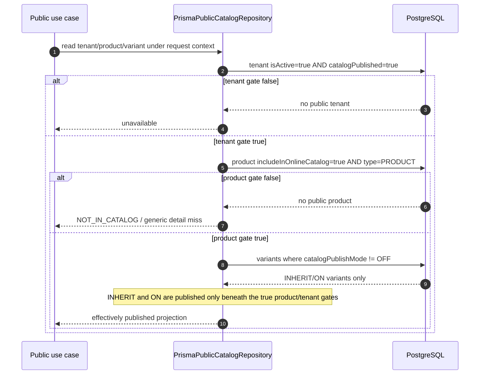

# Design — Online Catalog Publishing

Status: ready for task planning

Change: `online-catalog-publishing`

Scope: backend-only, F1–F3; F4 and all frontend work remain paused

## 1. Executive design

This change makes public catalog access explicitly tenant-controlled, binds every public browse/cart request to one tenant-public global price list, and separates stock presentation from operational stock authority.

The implementation has three bounded areas:

1. **`src/catalog-settings/`** owns tenant publication, tenant-public price-list bindings, and the tenant stock-presentation default behind authenticated admin routes.
2. **`src/products/`** continues to own product and variant publication/presentation fields plus the product-level price-context allowlist.
3. **`src/public-catalog/`** resolves the public tenant and selected price context, derives effective publication, performs no-fallback reads, maps stock presentation, and validates carts from current server data.

The persistence change is additive. Existing tenants remain unpublished, existing variants inherit publication, the existing global default list becomes each existing tenant's catalog default, and existing products resolve `SYSTEM_STATUS`. Public cache behavior remains HTTP-header-only: branches may be stale for at most 300 seconds, list/detail for at most 60 seconds, while cart validation and settings PATCH are `no-store`.

### 1.1 Ground-truth constraints reflected in this design

- The actual product price row is Prisma `PriceList`, mapped to `price_lists`; there is no `ProductPrice` model.
- `VariantPrice.priceListId` points to the product-specific `PriceList` row, not directly to `GlobalPriceList`.
- `GlobalPriceList` is global reference data; tenant publicity is therefore represented by a tenant binding rather than by changing `GlobalPriceList` itself.
- `PublicTenantGuard` currently establishes public CLS scope by slug, and `TenantPrismaService` injects tenant predicates only for names registered in `TENANT_SCOPED_MODELS`.
- `CacheControlInterceptor` emits response headers only; there is no application cache to purge.
- Authenticated tenant administration uses the `admin/tenants` prefix, while product and variant mutation remains under `ProductsController` and `update:Product`.

## 2. Architecture and component boundaries

```text
HTTP
├── /admin/tenants/:tenantId/catalog-settings
│   └── CatalogSettingsController
│       ├── GetCatalogSettingsUseCase
│       └── UpdateCatalogSettingsUseCase
│           └── CATALOG_SETTINGS_REPOSITORY
│               └── PrismaCatalogSettingsRepository
├── /products/**
│   └── existing ProductsController / ProductsService
│       ├── Product aggregate fields
│       ├── Variant direct persistence fields
│       └── ProductCatalogPriceList replacement
└── /public/catalog/**
    └── existing PublicCatalogController
        ├── PublicTenantGuard
        ├── PublicPriceContextResolver
        ├── ListPublicProductsUseCase
        ├── GetPublicProductDetailUseCase
        ├── ListPublicBranchesUseCase
        └── ValidatePublicCartUseCase
            └── PUBLIC_CATALOG_REPOSITORY
                └── PrismaPublicCatalogRepository
```

**Rationale.** Tenant catalog settings are aggregate-shaped configuration with their own permission and transaction boundary, so they do not belong in the already broad tenants service. Product and variant fields remain with their current aggregate and authorization. Public projection and validation stay in the existing public-catalog context so one resolver and repository contract enforce the same publication/context rules on every public surface.

## 3. Persistence design

### 3.1 Enums

```prisma
enum CatalogPublishMode {
  INHERIT
  ON
  OFF
}

enum CatalogStockPresentation {
  SYSTEM_STATUS
  ABSTRACT_STATUS
  CUSTOM_QUANTITY
  HIDDEN
}
```

`CatalogPublishMode` is non-null on variants. Stock-presentation fields are nullable where `null` means inheritance, not an unknown enum value.

### 3.2 Existing-model deltas

The following snippets are the merge-ready Prisma deltas inside the existing models. Existing fields and relations not shown remain unchanged.

```prisma
model Tenant {
  id        String   @id @default(uuid())
  name      String
  slug      String   @unique
  isActive  Boolean  @default(true)
  address   String?
  phone     String?

  // M1: public catalog is explicit opt-in.
  catalogPublished Boolean @default(false)

  // Required by the approved settings round-trip. Existing products are
  // explicitly backfilled to SYSTEM_STATUS in M5; new/null product modes
  // inherit this tenant default.
  catalogStockPresentationDefault          CatalogStockPresentation @default(SYSTEM_STATUS)
  catalogStockPresentationDefaultCustomQty Int?

  createdAt DateTime @default(now())
  updatedAt DateTime @updatedAt

  // Existing relations remain.
  tenantCatalogPriceLists  TenantCatalogPriceList[]
  productCatalogPriceLists ProductCatalogPriceList[]

  @@index([isActive, catalogPublished, name])
  @@map("tenants")
}
```

The two tenant stock-default columns complete the approved settings contract (`stockPresentationDefault`) without introducing F4 contact/branding data. Their effective use is only the first step of product→variant presentation resolution; M5 pins every pre-existing product to `SYSTEM_STATUS`, so rollout remains behaviorally neutral.

```prisma
model Product {
  // Existing fields remain.
  id       String @id @default(uuid())
  tenantId String

  includeInOnlineCatalog Boolean @default(true)
  hidePriceInOnlineCatalog Boolean @default(false)

  // null = inherit Tenant.catalogStockPresentationDefault.
  onlineStockPresentation          CatalogStockPresentation?
  onlineStockPresentationCustomQty Int?

  tenant            Tenant                    @relation(fields: [tenantId], references: [id], onDelete: Cascade)
  catalogPriceLists ProductCatalogPriceList[]

  // Existing public indexes are retained and reused:
  // @@index([tenantId, includeInOnlineCatalog, categoryId])
  // @@index([tenantId, includeInOnlineCatalog, createdAt(sort: Desc)])
  @@map("products")
}
```

```prisma
model Variant {
  id        String @id @default(uuid())
  productId String
  tenantId  String

  // M3: explicit tri-state publication; read-time inheritance.
  catalogPublishMode CatalogPublishMode @default(INHERIT)

  // null mode = inherit product effective mode. A custom quantity is used
  // only when the effective mode is CUSTOM_QUANTITY.
  onlineStockPresentation          CatalogStockPresentation?
  onlineStockPresentationCustomQty Int?

  tenant  Tenant  @relation(fields: [tenantId], references: [id], onDelete: Cascade)
  product Product @relation(fields: [productId], references: [id], onDelete: Cascade)

  @@index([tenantId])
  @@index([productId, catalogPublishMode])
  @@map("variants")
}
```

```prisma
model GlobalPriceList {
  id        String  @id @default(uuid())
  name      String  @unique
  isDefault Boolean @default(false)

  // Existing relations remain.
  tenantCatalogBindings  TenantCatalogPriceList[]
  productCatalogBindings ProductCatalogPriceList[]

  @@map("global_price_lists")
}
```

```prisma
model PriceList {
  id                String @id @default(uuid())
  productId         String
  globalPriceListId String
  priceCents        Int
  tenantId          String

  // Existing relations and constraints remain.
  @@unique([tenantId, productId, globalPriceListId])
  @@index([tenantId])
  // Supports context-wide positive-price filtering before pagination.
  @@index([tenantId, globalPriceListId, priceCents])
  @@map("price_lists")
}
```

```prisma
model VariantPrice {
  id          String @id @default(uuid())
  variantId   String
  priceListId String
  priceCents  Int
  tenantId    String

  // Existing relations and constraints remain.
  @@unique([tenantId, variantId, priceListId])
  @@index([tenantId])
  // priceListId identifies the product + selected global context row.
  @@index([tenantId, priceListId, priceCents])
  @@map("variant_prices")
}
```

**Index rationale.** Branch discovery gets a narrow active/published index. Existing product indexes already lead with tenant and publication. Variant publication is evaluated beneath a product, so `[productId, catalogPublishMode]` matches the nested read. The new `PriceList` and `VariantPrice` indexes support positive selected-context filtering rather than scanning every price row. Integration tests must verify plans are functionally served by these keys; introducing further indexes requires measured evidence rather than speculative duplication.

### 3.3 New join models

```prisma
model TenantCatalogPriceList {
  id                String   @id @default(uuid())
  tenantId          String
  globalPriceListId String
  isCatalogDefault  Boolean  @default(false)
  createdAt         DateTime @default(now())
  updatedAt         DateTime @updatedAt

  tenant          Tenant          @relation(fields: [tenantId], references: [id], onDelete: Cascade)
  globalPriceList GlobalPriceList @relation(fields: [globalPriceListId], references: [id], onDelete: Cascade)

  @@unique([tenantId, globalPriceListId])
  @@index([tenantId])
  @@map("tenant_catalog_price_lists")
}

model ProductCatalogPriceList {
  id                String   @id @default(uuid())
  tenantId          String
  productId         String
  globalPriceListId String
  createdAt         DateTime @default(now())
  updatedAt         DateTime @updatedAt

  tenant          Tenant          @relation(fields: [tenantId], references: [id], onDelete: Cascade)
  product         Product         @relation(fields: [productId], references: [id], onDelete: Cascade)
  globalPriceList GlobalPriceList @relation(fields: [globalPriceListId], references: [id], onDelete: Cascade)

  @@unique([tenantId, productId, globalPriceListId])
  @@index([tenantId])
  @@map("product_catalog_price_lists")
}
```

A PostgreSQL-only partial unique index enforces one catalog default without preventing many non-default bindings:

```sql
CREATE UNIQUE INDEX "tenant_catalog_price_lists_one_default_per_tenant"
  ON "tenant_catalog_price_lists" ("tenantId")
  WHERE "isCatalogDefault" = true;
```

Prisma does not express partial indexes in the schema DSL, so the migration is authoritative for this index, matching the repository's existing raw partial-index convention.

### 3.4 Product allowlist semantics

For product `P` and selected tenant-public global list `L`:

```text
supports(P, L) =
  no ProductCatalogPriceList rows exist for P
  OR a row exists for (tenantId, P, L)
```

- **Zero rows means all tenant-public lists.** This avoids a products × public-lists backfill.
- **One or more rows means only those listed IDs.** Product update replaces the set atomically.
- Product updates may only add IDs currently bound by `TenantCatalogPriceList` for the same tenant.
- Removing a tenant-public binding does **not** delete stale product allowlist rows. Deleting the last row could accidentally turn a narrowed product into “supports all”; retaining a now-private ID is conservative and cannot expose it because tenant context resolution runs first.

Both new models are added to `TENANT_SCOPED_MODELS`; Product and Variant are already registered. Every adapter still includes explicit `tenantId` predicates as defense in depth.

### 3.5 Database consistency constraints

The migration adds named checks that Prisma cannot declare:

```sql
ALTER TABLE "tenants"
  ADD CONSTRAINT "tenants_catalog_stock_default_custom_qty_nonnegative"
  CHECK ("catalogStockPresentationDefaultCustomQty" IS NULL OR "catalogStockPresentationDefaultCustomQty" >= 0);

ALTER TABLE "products"
  ADD CONSTRAINT "products_online_stock_custom_qty_nonnegative"
  CHECK ("onlineStockPresentationCustomQty" IS NULL OR "onlineStockPresentationCustomQty" >= 0);

ALTER TABLE "variants"
  ADD CONSTRAINT "variants_online_stock_custom_qty_nonnegative"
  CHECK ("onlineStockPresentationCustomQty" IS NULL OR "onlineStockPresentationCustomQty" >= 0);
```

Application/domain validation additionally requires a non-null custom quantity when an explicitly configured mode is `CUSTOM_QUANTITY`, and clears/rejects custom quantity for other explicit modes. Database checks protect the safety bound while application validation preserves the richer cross-field contract.

## 4. Migration and backfill plan (M1–M7)

Create one new timestamped folder following the current convention:

```text
prisma/migrations/<UTC timestamp>_online_catalog_publishing/migration.sql
```

Do not edit existing migrations. The migration is additive and orders dependent operations as follows:

1. Preflight the current global default-list invariant.
2. Create both enums.
3. Add tenant publication/default-presentation columns.
4. Create both join tables, ordinary indexes, partial unique index, checks, and foreign keys.
5. Add and backfill variant publication (`M3`), then set its default and non-null constraint.
6. Add product/variant stock-presentation columns and run `M5`.
7. Run `M4` only for tenants with no catalog binding.
8. Add remaining public-query indexes.

### 4.1 Step-by-step outcomes

| Step | Migration/design action                                                                                                                                        | Rationale                                                                          |
| ---- | -------------------------------------------------------------------------------------------------------------------------------------------------------------- | ---------------------------------------------------------------------------------- |
| M1   | Add `Tenant.catalogPublished BOOLEAN NOT NULL DEFAULT false`.                                                                                                  | Existing tenants must opt in; migration alone never widens visibility.             |
| M2   | No product column change; keep `includeInOnlineCatalog` default and subordinate it to the tenant gate.                                                         | Avoids rewriting product intent and leaves POS behavior untouched.                 |
| M3   | Stage `Variant.catalogPublishMode` nullable, set null rows to `INHERIT`, then apply default + `NOT NULL`.                                                      | Makes the explicit backfill inspectable and safe for existing rows.                |
| M4   | For each tenant with zero catalog bindings, bind the sole `GlobalPriceList.isDefault=true` row as public/default.                                              | Preserves the current default-list meaning without exposing any other global list. |
| M5   | Set every existing product null mode to `SYSTEM_STATUS`; leave variant override null; tenant default is `SYSTEM_STATUS`. Tenant default of `CUSTOM_QUANTITY` requires a non-null integer custom quantity `>= 0`; other tenant default modes require null custom quantity.                                       | Produces the current observable stock status on rollout.                           |
| M6   | No data rewrite; extend authenticated product round-trips for the existing `hidePriceInOnlineCatalog=false/true` values.                                       | Existing values remain authoritative.                                              |
| M7   | Read/write policy: a published product with no valid selected-context price is excluded, never emitted as zero; cart returns `PRICE_NOT_AVAILABLE_IN_CONTEXT`. | Prevents accidental free listings and makes missing coverage explicit.             |

### 4.2 Idempotent backfill SQL shape

```sql
-- M3: safe if re-evaluated before the NOT NULL step.
UPDATE "variants"
SET "catalogPublishMode" = 'INHERIT'::"CatalogPublishMode"
WHERE "catalogPublishMode" IS NULL;

-- M5: neutral presentation for existing products; variant null means inherit.
UPDATE "products"
SET "onlineStockPresentation" = 'SYSTEM_STATUS'::"CatalogStockPresentation"
WHERE "onlineStockPresentation" IS NULL;

UPDATE "variants"
SET "onlineStockPresentation" = NULL,
    "onlineStockPresentationCustomQty" = NULL
WHERE "onlineStockPresentation" IS NULL;
```

M4 first fails closed if the repository invariant is not exactly one global default:

```sql
DO $$
BEGIN
  IF (SELECT COUNT(*) FROM "global_price_lists" WHERE "isDefault" = true) <> 1 THEN
    RAISE EXCEPTION 'online catalog backfill requires exactly one default GlobalPriceList';
  END IF;
END $$;
```

It then seeds only tenants with no prior binding. The delivered migration uses `gen_random_uuid()::text` for new binding IDs:

```sql
INSERT INTO "tenant_catalog_price_lists" (
  "id", "tenantId", "globalPriceListId", "isCatalogDefault", "createdAt", "updatedAt"
)
SELECT
  gen_random_uuid()::text,
  t."id",
  g."id",
  true,
  CURRENT_TIMESTAMP,
  CURRENT_TIMESTAMP
FROM "tenants" t
CROSS JOIN "global_price_lists" g
WHERE g."isDefault" = true
  AND NOT EXISTS (
    SELECT 1
    FROM "tenant_catalog_price_lists" existing
    WHERE existing."tenantId" = t."id"
  )
ON CONFLICT ("tenantId", "globalPriceListId") DO NOTHING;
```

**Availability assumption.** `gen_random_uuid()` ships with PostgreSQL 13 and later (built-in to `pgcrypto` in 9.4–12; core in 13+); the project's supported PostgreSQL baseline assumes it is available without enabling an extension. The disposable-PostgreSQL migration suite (`prisma/online-catalog-publishing-migration.integration.spec.ts`) runs against a 13+ instance and asserts that this function produces non-null text IDs during M4.

**Rationale.** `WHERE NOT EXISTS` makes repeated execution non-destructive after an administrator changes settings; an upsert that forced the old global default back to `isCatalogDefault=true` would overwrite valid post-migration configuration.

### 4.3 New-tenant initialization

New tenants remain `catalogPublished=false`. Tenant creation SHOULD create one `TenantCatalogPriceList` binding to the current sole global default in the same transaction; if the invariant is unavailable, tenant creation remains successful but settings report `priceContexts: []`, and publication cannot be enabled until an administrator supplies a valid binding. This keeps tenant provisioning robust while publication stays fail-closed.

## 5. Catalog settings bounded context

### 5.1 File structure

```text
src/catalog-settings/
├── catalog-settings.module.ts
├── domain/
│   ├── tenant-catalog-settings.aggregate.ts
│   ├── tenant-catalog-settings.aggregate.spec.ts
│   ├── tenant-catalog-price-list.entity.ts
│   └── catalog-settings.repository.ts
├── application/
│   ├── get-catalog-settings.use-case.ts
│   ├── get-catalog-settings.use-case.spec.ts
│   ├── update-catalog-settings.use-case.ts
│   └── update-catalog-settings.use-case.spec.ts
├── infrastructure/
│   ├── prisma-catalog-settings.repository.ts
│   └── prisma-catalog-settings.repository.integration.spec.ts
├── dto/
│   ├── update-catalog-settings.dto.ts
│   └── catalog-settings-response.dto.ts
└── presentation/
    ├── catalog-settings.controller.ts
    └── catalog-settings.controller.spec.ts
```

`CatalogSettingsModule` imports `AuthModule`, binds `CATALOG_SETTINGS_REPOSITORY` to the Prisma adapter, and is imported by `AppModule`. A direct root-module import keeps the root bounded context independent of the implementation layout under `src/admin/`, while its routes still follow the established admin prefix.

### 5.2 Domain model and repository port

`TenantCatalogSettings` is an aggregate projection over one Tenant and its catalog bindings. It owns these invariants:

- default ID is included in the public-list set;
- a non-empty public-list set has exactly one default;
- `catalogPublished=true` requires a non-empty set and a default;
- IDs are unique;
- explicit `CUSTOM_QUANTITY` requires an integer custom quantity ≥ 0;
- non-custom explicit defaults reject/clear custom quantity;
- `effectivePublication = isActive && catalogPublished`.

```ts
export const CATALOG_SETTINGS_REPOSITORY = Symbol(
  'CATALOG_SETTINGS_REPOSITORY',
);

export interface ICatalogSettingsRepository {
  findByTenantId(tenantId: string): Promise<TenantCatalogSettings | null>;
  replace(
    settings: TenantCatalogSettings,
    actorUserId: string,
  ): Promise<TenantCatalogSettings>;
  findGlobalPriceListsByIds(
    ids: string[],
  ): Promise<Array<{ id: string; name: string }>>;
  countDefaultContextCoverage(
    tenantId: string,
    globalPriceListId: string,
  ): Promise<number>;
}
```

`replace` uses `TenantPrismaService.runInTransaction()`, takes a tenant-row lock (`SELECT ... FROM "tenants" WHERE "id" = $tenantId FOR UPDATE` with an explicit tenant ID), then:

1. sets existing bindings to non-default;
2. upserts the requested set as non-default;
3. deletes tenant bindings not in the requested set;
4. marks the selected default binding true;
5. updates Tenant publication and stock-default columns;
6. reloads and returns the aggregate.

The row lock serializes concurrent settings replacements. Each PATCH is atomic; last committed writer wins. The partial unique index is the race-safe final guard.

### 5.3 Routes and authorization

```text
GET   /admin/tenants/:tenantId/catalog-settings
PATCH /admin/tenants/:tenantId/catalog-settings
```

Controller policy:

```ts
@Controller('admin/tenants/:tenantId/catalog-settings')
@UseGuards(JwtAuthGuard, TenantContextGuard, PermissionsGuard)
export class CatalogSettingsController {
  @Get()
  @RequirePermissions(['read', 'TenantCatalogSettings'])

  @Patch()
  @Header('Cache-Control', 'no-store')
  @RequirePermissions(['update', 'TenantCatalogSettings'])
}
```

Both routes parse `tenantId` with `ParseUUIDPipe`. For a normal tenant user, the use case requires `JWT tenantId === path tenantId`; mismatch is surfaced as not found/unavailable to avoid a tenant-existence oracle. A global super-admin with `manage:all` may target the path tenant. The repository always filters by the path tenant explicitly, including in super-admin mode.

PATCH receives `@CurrentUser()` so the use case can write a structured audit log containing actor ID, tenant ID, changed setting names, and commit timestamp. No contact/phone field is added: F4 is deferred. Consequently no new phone normalization runs in F1–F3; a later contact change should normalize to E.164 before persistence rather than silently changing existing `Tenant.phone` here.

### 5.4 DTO contracts

```ts
export class StockPresentationSettingDto {
  @IsEnum(CatalogStockPresentation)
  mode: CatalogStockPresentation;

  @IsOptional()
  @Type(() => Number)
  @IsInt()
  @Min(0)
  customQuantity?: number | null;
}

export class UpdateCatalogSettingsDto {
  @IsOptional()
  @IsBoolean()
  catalogPublished?: boolean;

  @IsOptional()
  @IsArray()
  @ArrayUnique()
  @IsUUID('4', { each: true })
  publicPriceListIds?: string[];

  @IsOptional()
  @IsUUID('4')
  catalogDefaultPriceListId?: string | null;

  @IsOptional()
  @ValidateNested()
  @Type(() => StockPresentationSettingDto)
  stockPresentationDefault?: StockPresentationSettingDto;
}
```

The global validation pipe already uses `whitelist`, `forbidNonWhitelisted`, and `transform`; unknown fields and unknown enum values fail with 400.

Response:

```ts
export interface CatalogSettingsResponseDto {
  tenantId: string;
  catalogPublished: boolean;
  effectivePublication: boolean; // catalogPublished && tenant.isActive
  priceContexts: Array<{
    priceListId: string;
    name: string;
    isCatalogDefault: boolean;
  }>;
  stockPresentationDefault: {
    mode: CatalogStockPresentation;
    customQuantity: number | null;
  };
  warnings: Array<'DEFAULT_CONTEXT_HAS_NO_VALID_PRICES'>;
  updatedAt: string;
}
```

A zero-coverage default is allowed because M7 defines the safe behavior (empty/excluded products), but GET/PATCH returns `DEFAULT_CONTEXT_HAS_NO_VALID_PRICES`. This warns without inventing a price or partially committing the settings update.

## 6. Authenticated product and variant round-trips

### 6.1 Product contract

Extend `CreateProductDto`/`UpdateProductDto`, Product domain persistence/response, repository mapping, `findAll`, and `buildFullResponse` with:

```ts
hidePriceInOnlineCatalog?: boolean;
supportedCatalogPriceListIds?: string[]; // UUID, unique; []/omitted = all public
onlineStockPresentation?: CatalogStockPresentation | null;
onlineStockPresentationCustomQty?: number | null; // integer >= 0
```

Responses add:

```ts
hidePriceInOnlineCatalog: boolean;
supportsAllCatalogPriceLists: boolean;
supportedCatalogPriceListIds: string[];
onlineStockPresentation: CatalogStockPresentation | null;
onlineStockPresentationCustomQty: number | null;
```

Create/update validates every non-empty supported ID against the caller tenant's current `TenantCatalogPriceList` rows. Product persistence and allowlist replacement join the existing product transaction, preventing the product fields and allowlist from diverging. Every touched product/variant query uses `tenantPrisma.getClient()` plus explicit `tenantId`/`productId` predicates; the current raw `this.prisma.variant` calls in `getVariants`, `updateVariant`, and related mutation paths must not be reused for these fields. `update:Product` remains the only permission needed.

### 6.2 Variant contract

Extend `UpdateVariantDto`, direct Prisma writes, variant reads, and response enrichers with:

```ts
catalogPublishMode?: 'INHERIT' | 'ON' | 'OFF';
onlineStockPresentation?: CatalogStockPresentation | null;
onlineStockPresentationCustomQty?: number | null;
```

Variant create and inline-create do not require new fields and persist `catalogPublishMode=INHERIT`; stock override remains null. This preserves the approved “create by reference, not copy” behavior. A later PATCH may explicitly set publication or presentation. Product/variant writes continue to use `update:Product`; catalog-settings permission is not consulted.

Cross-field validation is shared by product and variant DTO/application paths:

- custom quantity must be an integer ≥ 0;
- explicit `CUSTOM_QUANTITY` requires a custom quantity;
- explicit non-custom mode rejects a non-null custom quantity;
- variant null mode means full inheritance and therefore stores null custom quantity.

## 7. Public catalog application contracts

### 7.1 Price context

Internally, `priceListId` means `GlobalPriceList.id`. It is intentionally not the product-specific `PriceList.id`.

```ts
export interface ResolvedPublicCatalogContext {
  tenantId: string;
  tenantSlug: string;
  globalPriceListId: string;
  name: string;
  isCatalogDefault: boolean;
}

export interface PublicPriceContextDto {
  priceListId: string;
  name: string;
  isCatalogDefault: boolean;
}
```

`PublicPriceContextResolver` is an application service. It calls the repository with tenant slug and optional requested UUID:

- provided ID: resolve only an active, published tenant binding for that exact global ID;
- omitted ID: resolve that tenant's `isCatalogDefault=true` binding;
- no match: throw `PriceContextNotAvailableError` with stable code `PRICE_CONTEXT_NOT_AVAILABLE`, generic message `Price context is not available`, and HTTP 404.

Private, nonexistent, cross-tenant, and unbound IDs share the same query miss, error object, message, and status. The resolver never performs a second lookup that could reveal why the binding missed.

### 7.2 Extended repository port

Replace the current default-list-specific methods with context-explicit contracts:

```ts
export interface IPublicCatalogRepository {
  resolveTenantCatalogContext(
    tenantSlug: string,
    requestedGlobalPriceListId?: string,
  ): Promise<ResolvedPublicCatalogContext | null>;

  listPublicBranches(): Promise<PublicBranchDto[]>;

  listPublicProducts(params: {
    tenantId: string;
    context: ResolvedPublicCatalogContext;
    filters: ListProductsParams;
  }): Promise<{
    items: ProductWithIncludes[];
    total: number;
    excludedCount: number;
    categories: PublicCatalogCategoryFacet[];
  }>;

  getPublicProductDetail(params: {
    tenantId: string;
    productId: string;
    context: ResolvedPublicCatalogContext;
  }): Promise<ProductDetailWithIncludes | null>;

  findPublicCartCandidates(params: {
    tenantId: string;
    context: ResolvedPublicCatalogContext;
    productIds: string[];
    variantIds: string[];
  }): Promise<PublicCartCandidate[]>;
}
```

`ValidatePublicCartUseCase` moves off direct `TenantPrismaService` access and uses the same port/context resolver as list/detail. This is the key symmetry that prevents cart and browse from drifting.

### 7.3 Request and response extensions

- `ListProductsQueryDto` adds optional `@IsUUID() priceListId`.
- Detail adds `PublicPriceContextQueryDto` with the same optional field.
- `ValidateCartBodyDto` adds top-level optional UUID `priceListId` and removes the unused nested `customer.globalPriceListId` contract. Omission means tenant catalog default.
- Existing pagination/search/sort fields remain.

List response:

```ts
interface PublicProductListResponse {
  items: PublicCatalogProductCard[];
  meta: { page: number; limit: number; total: number; totalPages: number };
  facets: { categories: PublicCatalogCategoryFacet[] };
  excludedCount: number;
  priceContext: PublicPriceContextDto;
}
```

Detail extends the existing product body with:

```ts
priceContext: PublicPriceContextDto;
excludedCount: 0;
```

A context-valid but unpublished, unsupported, or unpriceable product detail remains generic 404. `excludedCount` is product-level and aggregate-only: base published/filter-matching count minus eligible count before pagination. No excluded product ID or reason is returned. Facet counts and `meta.total` are computed over context-eligible products, not over rows later filtered in memory.

### 7.4 Price-context resolution and listing flow

```mermaid
sequenceDiagram
  autonumber
  participant C as Public client
  participant G as PublicTenantGuard
  participant CT as PublicCatalogController
  participant R as PublicPriceContextResolver
  participant P as PUBLIC_CATALOG_REPOSITORY
  participant DB as PostgreSQL

  C->>G: GET /public/catalog/:slug/products?priceListId=L
  G->>DB: Tenant where slug, isActive=true, catalogPublished=true
  alt tenant unavailable
    DB-->>G: null
    G-->>C: generic 404 Not Found
  else tenant published
    DB-->>G: tenant
    G->>G: seed CLS tenant scope
    G->>CT: continue
    CT->>R: resolve(slug, L?)
    R->>P: resolveTenantCatalogContext(slug, L?)
    P->>DB: published tenant JOIN tenant_catalog_price_lists JOIN global_price_lists
    alt private / nonexistent / cross-tenant / unbound
      DB-->>P: null
      P-->>R: null
      R-->>C: 404 PRICE_CONTEXT_NOT_AVAILABLE
    else context public
      DB-->>P: selected context
      R-->>CT: ResolvedPublicCatalogContext
      CT->>P: listPublicProducts(tenantId, context, filters/page)
      P->>DB: base count + eligible context query + facets
      Note over P,DB: tenant gate + product gate + allowlist + exact selected price; no fallback
      DB-->>P: eligible page, total, excludedCount, facets
      P-->>CT: projection data
      CT-->>C: items + priceContext + excludedCount (Cache-Control max-age=60)
    end
  end
```

### 7.5 No-fallback query rules

The adapter always filters by `globalPriceListId = context.globalPriceListId`:

- simple product numeric price: `PriceList` for `(tenant, product, selected global list)` with `priceCents > 0`;
- variant numeric price: `VariantPrice` whose `priceList.globalPriceListId` is the selected list and whose `priceCents > 0`;
- no query contains `globalPriceList.isDefault=true` after F2;
- no query retries against another list.

For a visible-price product, product allowlist support is checked before price output. A visible-price simple product requires a positive product `PriceList` row. A visible-price variant product requires a positive product row and at least one effectively published variant with a positive selected-context `VariantPrice`; unpriced/unpublished variants are omitted from detail. If no variants survive, the product is excluded.

Hidden-price precedence is applied immediately after effective publication. When `hidePriceInOnlineCatalog || requiresPrescription`, the product remains visible/valid without consulting the product support allowlist or requiring a positive numeric row; every numeric price remains null and no alternate context is queried. This literal precedence follows the approved hidden-price requirement: a hidden numeric value cannot make the item context-unavailable. The tenant's selected context binding is still mandatory, so a private/nonexistent context remains indistinguishable and unavailable.

### 7.6 Effective publication derivation

```text
Tenant gate  = tenant.isActive && tenant.catalogPublished
Product gate = Tenant gate
               && product.includeInOnlineCatalog
               && product.type === PRODUCT
Variant gate = Product gate
               && (variant.catalogPublishMode === INHERIT
                   || variant.catalogPublishMode === ON)
               && variant.catalogPublishMode !== OFF
```

`ON` records explicit merchant intent but cannot bypass a false tenant/product gate. For a product with variants, the product card/detail is retained only when at least one variant passes effective publication and context pricing (except numeric pricing skipped by hidden-price precedence).



## 8. Cart validation design

### 8.1 Response contract

```ts
type CartBlockingCode =
  | 'NOT_IN_CATALOG'
  | 'VARIANT_NOT_FOUND'
  | 'VARIANT_NOT_IN_CATALOG'
  | 'PRICE_NOT_AVAILABLE_IN_CONTEXT'
  | 'OUT_OF_STOCK';

type CartWarningCode =
  | CartBlockingCode
  | 'LOW_STOCK'
  | 'PRICE_HIDDEN'
  | 'PRICE_CHANGED';

interface CartValidatedItem {
  productId: string;
  variantId: string | null;
  // Redacted to null on any blocking code whose product/variant is
  // missing or fails the effective publication gate.
  productName: string | null;
  variantName: string | null;
  image: { url: string } | null;
  quantity: number;
  status: 'VALID' | 'BLOCKED';
  blockingCodes: CartBlockingCode[];
  warnings: CartWarningCode[];
  unitPriceCents: number | null;
  lineTotalCents: number | null;
  availability: 'available' | 'low_stock' | 'out_of_stock';
  priceHidden: boolean;
}

interface CartValidationResponseDto {
  valid: boolean;
  priceContext: PublicPriceContextDto;
  items: CartValidatedItem[];
  warnings: CartWarningCode[];
  totalCents: number | null;
}
```

`PRICE_CONTEXT_NOT_AVAILABLE` is a request-level 404 because no trustworthy item reconciliation can occur without a valid context. All other new/existing codes are per-item blocking codes. Existing warning codes remain compatible.

### 8.2 Per-item decision order

1. Resolve the published tenant and one public context.
2. Bulk-load requested products/variants under tenant scope; preserve input order in the response.
3. **Catalog-membership miss (uniform):** missing product ID and product that fails the effective product gate both resolve to `NOT_IN_CATALOG`. The blocked item MUST redact `productName`, `variantName`, and `image` to `null`; no other code, metadata, or detail distinguishes the missing case from the unpublished case.
4. Requested variant absent or not a child of the product → `VARIANT_NOT_FOUND` (still subject to the same redaction).
5. Existing requested variant resolves `OFF` → `VARIANT_NOT_IN_CATALOG` (same redaction).
6. Compute hidden-price precedence. If hidden, set numeric fields null and skip product allowlist/positive-price checks.
7. Otherwise verify product allowlist support and require the exact selected-list product/variant price `> 0`; unsupported, missing, or non-positive price blocks with `PRICE_NOT_AVAILABLE_IN_CONTEXT`.
8. Independently inspect operational stock. `useStock=false` is available. Otherwise quantity `<= 0` adds `OUT_OF_STOCK` in every presentation mode; positive quantity at/below `minQuantity` adds non-blocking `LOW_STOCK`.
9. Recompute line totals only from server prices. Blocked lines do not contribute. If any reconciled published item has a hidden price, response `totalCents=null`; otherwise sum valid visible lines.

Client-supplied prices are not part of the DTO and therefore cannot influence the result.

### 8.2.1 Cart anti-disclosure invariant

The cart response MUST NOT distinguish a missing product from a product the catalog no longer serves. The catalog-membership miss code (`NOT_IN_CATALOG`) and the `null` redaction of `productName`, `variantName`, and `image` apply uniformly to every blocked item whose product or variant is missing or fails the effective publication gate. No alternate code, status, or identifier is returned. This invariant preserves invariant (b) (private-list non-enumeration) and prevents an attacker from probing private catalog membership via cart responses.

### 8.3 Cart sequence

```mermaid
sequenceDiagram
  autonumber
  participant C as Public client
  participant G as PublicTenantGuard
  participant CT as PublicCatalogController
  participant R as PublicPriceContextResolver
  participant V as ValidatePublicCartUseCase
  participant P as PUBLIC_CATALOG_REPOSITORY
  participant DB as PostgreSQL

  C->>G: POST /public/catalog/:slug/cart/validate {priceListId, items}
  G->>DB: resolve active + catalogPublished tenant
  alt tenant unavailable
    G-->>C: generic 404
  else tenant published
    G->>CT: CLS tenant established
    CT->>R: resolve(slug, priceListId?)
    R->>P: resolveTenantCatalogContext
    alt context unavailable
      P-->>R: null
      R-->>C: 404 PRICE_CONTEXT_NOT_AVAILABLE
    else context resolved
      R-->>CT: context
      CT->>V: execute(context, items)
      V->>P: findPublicCartCandidates(productIds, variantIds, context)
      P->>DB: one tenant-scoped bulk read with exact selected-list prices
      DB-->>P: current publication, allowlists, prices, stock
      P-->>V: candidates
      loop each input item in request order
        V->>V: product/variant publication checks
        alt hidden price
          V->>V: numeric price + line total = null
        else unsupported/missing/price <= 0
          V->>V: block PRICE_NOT_AVAILABLE_IN_CONTEXT
        else exact context price
          V->>V: recompute unit and line cents
        end
        V->>V: operational stock check independent of presentation
        alt useStock=false
          V->>V: available
        else operational quantity <= 0
          V->>V: block OUT_OF_STOCK
        else quantity <= minQuantity
          V->>V: warn LOW_STOCK
        end
      end
      V->>V: valid = no blocking codes; recompute total
      V-->>CT: reconciliation + priceContext
      CT-->>C: 200, Cache-Control: no-store
    end
  end
```

## 9. Stock presentation resolution (F3)

### 9.1 Effective configuration

```text
productMode = product.onlineStockPresentation
              ?? tenant.catalogStockPresentationDefault
              ?? SYSTEM_STATUS

productCustomQty = product.onlineStockPresentationCustomQty
                   ?? tenant.catalogStockPresentationDefaultCustomQty

variantMode = variant.onlineStockPresentation ?? productMode
variantCustomQty = variant.onlineStockPresentation == null
                   ? productCustomQty
                   : variant.onlineStockPresentationCustomQty
```

**Tenant-default invariants.** A tenant `catalogStockPresentationDefault` of `CUSTOM_QUANTITY` MUST carry a non-null `catalogStockPresentationDefaultCustomQty` integer `>= 0`; any other tenant default mode MUST carry `null`. The database `tenants_catalog_stock_default_custom_qty_nonnegative` check enforces the `>= 0` bound; the cross-field rule is enforced by DTO/domain validation in `UpdateCatalogSettingsDto` (`StockPresentationSettingDto`) and the settings aggregate (WU3).

M5 means existing products take the first branch as explicit `SYSTEM_STATUS`; variant null continues to inherit at read time. No presentation value is copied into a variant on creation.

### 9.2 Public output

Add a stable stock projection to product cards and detail variants:

```ts
interface PublicStockPresentationDto {
  mode: 'SYSTEM_STATUS' | 'ABSTRACT_STATUS' | 'CUSTOM_QUANTITY' | 'HIDDEN';
  status: 'available' | 'low_stock' | 'out_of_stock' | null;
  customQuantity: number | null;
}
```

| Effective mode    | Positive operational stock                      | Low operational stock                           | Zero operational stock                                                        | Public numeric quantity      |
| ----------------- | ----------------------------------------------- | ----------------------------------------------- | ----------------------------------------------------------------------------- | ---------------------------- |
| `SYSTEM_STATUS`   | `available`                                     | `low_stock`                                     | `out_of_stock`                                                                | `null`                       |
| `ABSTRACT_STATUS` | `available`                                     | `available`                                     | `out_of_stock`                                                                | `null`                       |
| `CUSTOM_QUANTITY` | status may be `null`; configured quantity shown | status may be `null`; configured quantity shown | forced `out_of_stock`; configured quantity may still be shown as presentation | configured custom value only |
| `HIDDEN`          | `null`                                          | `null`                                          | `null`                                                                        | `null`                       |

For `useStock=false`, operational availability is always available: SYSTEM/ABSTRACT map to `available`, CUSTOM may show its configured presentation quantity, and HIDDEN remains indicator-free.

The existing `availability` field becomes nullable for `HIDDEN` and mirrors `stockPresentation.status` for compatibility; snapshots must prove raw `quantity`/`minQuantity` never leak.

### 9.3 Products with variants (Q6)

Only effectively published variants participate. Operational statuses aggregate with this precedence:

```text
any available -> available
else any low_stock -> low_stock
else -> out_of_stock
```

- Product-level `HIDDEN` suppresses the product-card stock indicator regardless of variant overrides.
- A product with variants configured `CUSTOM_QUANTITY` shows aggregate status on the product card and no product custom quantity.
- Custom quantities are rendered only on variant rows in a variant product. Each variant uses its effective inherited/overridden custom value; a variant override applies only to that variant.
- Cart validation ignores this aggregate and checks the requested variant's operational stock.

**Rationale.** Available-first gives a truthful “some option can be bought” card without manufacturing inventory. HIDDEN preserves the merchant's product-level disclosure choice. Product custom quantities cannot be meaningfully summed across variants, so only variant rows display them.

### 9.4 Zero-stock invariant location

`ValidatePublicCartUseCase` owns the blocking invariant after publication/context checks and before final totals. The stock mapper owns presentation only. This separation is deliberate: changing mapper behavior, hiding stock, or configuring a positive custom quantity cannot bypass `OUT_OF_STOCK`.

## 10. Settings publication flow and cache behavior

```mermaid
sequenceDiagram
  autonumber
  participant A as Authenticated admin
  participant G as JWT + TenantContext + Permissions guards
  participant C as CatalogSettingsController
  participant U as UpdateCatalogSettingsUseCase
  participant R as PrismaCatalogSettingsRepository
  participant DB as PostgreSQL
  participant X as Browser/CDN cache

  A->>G: PATCH /admin/tenants/T/catalog-settings
  G->>G: require update:TenantCatalogSettings
  G->>C: authorized request
  C->>U: DTO + path tenantId + actorUserId
  U->>U: enforce caller/path scope and aggregate invariants
  U->>R: replace(settings, actor)
  R->>DB: BEGIN; SELECT tenant T FOR UPDATE
  R->>DB: validate globals; replace bindings; set default; update Tenant
  DB-->>R: committed settings projection
  R-->>U: saved aggregate
  U->>U: structured audit log + coverage warning
  U-->>C: CatalogSettingsResponseDto
  C-->>A: 200 Cache-Control: no-store
  Note over X: no active purge target exists
  par Public list/detail
    X-->>A: old response may live <= 60s
  and Branch discovery
    X-->>A: old branch response may live <= 300s
  and Cart validation
    A->>DB: next no-store validation reads current settings
  end
```

List/detail URLs are naturally context-keyed by the full URI, including `priceListId`. Omitted `priceListId` is a separate default-context URI. Proxies/CDNs must retain query strings in their cache key; no `Vary` header is needed for a URI query component. Context metadata in each body makes the resolved context explicit. There is no server cache and no active invalidation hook.

## 11. Authorization design

Add `'TenantCatalogSettings'` to `AppSubjects` and exactly two registry entries:

```ts
{
  subject: 'TenantCatalogSettings',
  action: 'read',
  description: 'View tenant online catalog publication settings',
},
{
  subject: 'TenantCatalogSettings',
  action: 'update',
  description: 'Publish or update tenant online catalog settings',
},
```

The existing `PermissionSeeder` needs no algorithm change: it upserts registry entries by `(subject, action)` and remains idempotent. Tests extend the current registry/seeder pattern.

No role receives these rows automatically. In particular, a role with `update:Product` does not imply either settings action. Access comes only from an explicit role-permission assignment or global `manage:all`. Product and variant online fields remain guarded by existing `create/read/update:Product` routes.

**Rationale.** Publishing a tenant and exposing price contexts are go-live/business controls, not content editing. A dedicated subject prevents accidental privilege expansion and gives audit/UI surfaces an explicit grant.

## 12. Error and HTTP contracts

| Condition                                                   | Surface                  | Code/status                                | Disclosure behavior                 |
| ----------------------------------------------------------- | ------------------------ | ------------------------------------------ | ----------------------------------- |
| Tenant inactive/unpublished/unknown                         | public tenant routes     | existing generic 404                       | identical `Not Found`               |
| Context private/nonexistent/cross-tenant/unbound/no default | list/detail/cart request | `PRICE_CONTEXT_NOT_AVAILABLE`, 404         | one generic message/status          |
| Product missing                                             | cart item                | `NOT_IN_CATALOG`, blocking                 | `productName`/`variantName`/`image` redacted; same outcome as excluded |
| Product excluded/type SERVICE                               | cart item                | `NOT_IN_CATALOG`, blocking                 | `productName`/`variantName`/`image` redacted; price/stock not evaluated publicly |
| Variant ID absent/not child                                 | cart item                | `VARIANT_NOT_FOUND`, blocking              | name/image redacted; no cross-product disclosure |
| Variant exists but effective mode OFF                       | cart item                | `VARIANT_NOT_IN_CATALOG`, blocking         | name/image redacted; no price/stock disclosure |
| Visible-price product unsupported or selected price missing/≤0 | cart item              | `PRICE_NOT_AVAILABLE_IN_CONTEXT`, blocking | no fallback price                   |
| Hidden-price product bypasses allowlist/positive-price      | list/detail/cart         | `null` numeric fields/totals               | product stays visible/cart-valid    |
| Operational stock ≤0                                        | cart item                | `OUT_OF_STOCK`, blocking                   | independent of presentation         |
| Invalid settings UUID/enum/custom quantity                  | admin PATCH              | validation 400                             | no write                            |
| Default not in public set / publish without default         | admin PATCH              | domain 422                                 | transaction not started/rolled back |
| Partial-default unique race                                 | admin PATCH              | mapped P2002 → 409                         | no partial mutation                 |
| Missing settings permission                                 | admin routes             | existing 403                               | no repository call                  |

Add the request-level context error mapping to `DomainExceptionFilter`; item codes are response values, not thrown exceptions.

## 13. Architecture Decision Records

### ADR-1 — Tenant publication gate is first and conjunctive

**Decision.** Require active + `catalogPublished` before any product, variant, price, or stock projection; product and variant controls can only narrow visibility.

**Rationale.** A single fail-closed tenant check is the cheapest non-disclosure boundary and prevents a variant `ON` value from widening visibility.

**Consequences.** M1 intentionally hides all existing tenants until activation; every public route and cart re-derives the gate from current data.

### ADR-2 — Variant publication uses a tri-state enum

**Decision.** Store `INHERIT | ON | OFF`, default `INHERIT`, and resolve at read time rather than copying product state.

**Rationale.** The states are explicit in Prisma, DTOs, indexes, and logs; nullable booleans conflate inheritance with missing data. Read-time inheritance avoids write amplification.

**Consequences.** `ON` preserves explicit intent but never bypasses tenant/product gates.

### ADR-3 — Join-table allowlists with absent-row semantics

**Decision.** Use tenant and product join tables; zero product rows means all tenant-public lists.

**Rationale.** Global lists are reference data, tenant publicity is contextual, and absent-row semantics avoid a products × lists backfill while allowing explicit narrowing.

**Consequences.** Application validation enforces current public IDs; stale narrowed rows are retained conservatively when a tenant unpublishes a list.

### ADR-4 — TTL-bounded cache with no active invalidation

**Decision.** Preserve header-only cache behavior: list/detail 60 seconds, branches 300 seconds, cart/settings PATCH no-store.

**Rationale.** The codebase has no cache store or purge API. Adding CDN-specific infrastructure would exceed the accepted requirement that depublication take effect within TTL.

**Consequences.** Browse depublication is bounded, not instant; cart sees committed state on its next request.

### ADR-5 — Dedicated `TenantCatalogSettings` permission subject

**Decision.** Add only `read` and `update`; do not infer them from Product or Tenant permissions.

**Rationale.** Go-live and public pricing exposure are business controls requiring explicit, auditable delegation.

**Consequences.** Product editors retain product/variant editing but receive no settings access unless explicitly granted.

### ADR-6 — Exact-context no-fallback on browse and cart

**Decision.** Missing/zero selected prices exclude from browse and block cart with `PRICE_NOT_AVAILABLE_IN_CONTEXT`; invalid contexts fail with `PRICE_CONTEXT_NOT_AVAILABLE`.

**Rationale.** Applying the rule on only one surface makes displayed catalogs irreconcilable and risks accidental zero/default pricing.

**Consequences.** Default-context coverage may shrink after rollout; `excludedCount` and admin warnings provide aggregate evidence without substituting a price.

### ADR-7 — New `catalog-settings` bounded context

**Decision.** Create `src/catalog-settings/` instead of extending `src/tenants/`.

**Rationale.** The aggregate owns tenant-public bindings, atomic replacement, publication rules, and a dedicated permission; it also provides a future home for separately approved F4 settings without bloating tenants.

**Consequences.** One new module/port/adapter is introduced; public and product contexts consume persistence, not the settings controller.

### ADR-8 — Available-first variant stock aggregation

**Decision.** Aggregate only published variants with `available > low_stock > out_of_stock`; product HIDDEN wins; product cards never sum custom quantities.

**Rationale.** The card answers whether any published option is buyable while preserving operational truth per variant and avoiding meaningless custom-quantity arithmetic.

**Consequences.** Cart never trusts the aggregate and always checks the selected variant.

## 14. File-change map

| Path                                                                                     | Change                                                                                                |
| ---------------------------------------------------------------------------------------- | ----------------------------------------------------------------------------------------------------- |
| `prisma/schema.prisma`                                                                   | Add enums, tenant/product/variant fields, both join models/relations, and public-query indexes.       |
| `prisma/migrations/<ts>_online_catalog_publishing/migration.sql`                         | Additive schema, partial unique/checks, M3/M4/M5 backfills.                                           |
| `src/shared/tenant/tenant-scoped-models.constant.ts`                                     | Register `TenantCatalogPriceList` and `ProductCatalogPriceList`.                                      |
| `src/catalog-settings/**`                                                                | New bounded context described in §5.                                                                  |
| `src/app.module.ts`                                                                      | Import `CatalogSettingsModule`.                                                                       |
| `src/tenants/tenants.service.ts` and specs                                               | Initialize a default binding for newly created tenants when possible.                                 |
| `src/products/dto/create-product.dto.ts`                                                 | Product fields plus validation; inline variants keep inherit defaults.                                |
| `src/products/dto/update-product.dto.ts`                                                 | Inherits product extensions through `PartialType`.                                                    |
| `src/products/dto/variant.dto.ts`                                                        | Variant publication/presentation PATCH fields.                                                        |
| `src/products/domain/product.entity.ts`                                                  | Persist/round-trip hidden-price and product presentation fields.                                      |
| `src/products/domain/product.repository.ts`                                              | Extend product persistence contract if needed by mapper types.                                        |
| `src/products/infrastructure/prisma-product.repository.ts`                               | Map added Product fields.                                                                             |
| `src/products/products.service.ts`                                                       | Atomic allowlist validation/replacement; variant fields; complete read projections.                   |
| `src/products/**/*.spec.ts`                                                              | DTO, entity, service, response round-trip evidence.                                                   |
| `src/public-catalog/application/ports/public-catalog.repository.ts`                      | Context-explicit port contracts.                                                                      |
| `src/public-catalog/application/services/public-price-context-resolver.ts`               | New public context resolver.                                                                          |
| `src/public-catalog/application/use-cases/*.ts`                                          | Apply resolver, context, publication, count, and cart rules.                                          |
| `src/public-catalog/application/dto/*.ts`                                                | Price metadata, excluded count, stock projection, cart codes/status.                                  |
| `src/public-catalog/application/mappers/public-product.mapper.ts`                        | Context price and effective stock mapping; omit unpublished variants.                                 |
| `src/public-catalog/domain/value-objects/effective-publication.vo.ts`                    | Pure tenant/product/variant gate derivation.                                                          |
| `src/public-catalog/domain/value-objects/stock-presentation.vo.ts`                       | Mode inheritance/output/aggregation.                                                                  |
| `src/public-catalog/domain/errors/price-context-not-available.error.ts`                  | Generic request-level context error.                                                                  |
| `src/public-catalog/infrastructure/prisma-public-catalog.repository.ts`                  | Published branches, exact-context joins, base/eligible counts, cart candidates.                       |
| `src/public-catalog/infrastructure/prisma-public-catalog.repository.integration.spec.ts` | Real-DB isolation, no-fallback, partial/context query evidence.                                       |
| `src/public-catalog/http/guards/public-tenant.guard.ts`                                  | Require `catalogPublished=true`.                                                                      |
| `src/public-catalog/http/request-dto/*.ts`                                               | UUID `priceListId`; top-level cart context.                                                           |
| `src/public-catalog/http/public-catalog.controller.ts`                                   | Pass tenant/context inputs; retain TTL/throttle annotations.                                          |
| `src/public-catalog/public-catalog.module.ts`                                            | Register resolver and new services; keep named throttlers unchanged.                                  |
| `src/auth/authorization/domain/permission.ts`                                            | Add subject and two permission rows.                                                                  |
| `src/auth/authorization/domain/permission-registry-catalog-settings.spec.ts`             | Exact action-set evidence.                                                                            |
| `src/auth/authorization/infrastructure/permission.seeder.spec.ts`                        | Verify idempotent settings permission upserts.                                                        |
| `src/shared/filters/domain-exception.filter.ts`                                          | Map `PRICE_CONTEXT_NOT_AVAILABLE` to 404 and partial-default conflict as designed.                    |
| `docs/backend-responses/public-online-catalog-frontend-guide.md`                         | Publish changed admin/public DTOs, examples, errors, cache/rates; do not add frontend implementation. |

## 15. Test strategy and acceptance evidence

Although `openspec/config.yaml` sets `apply.tdd: false`, each implementation slice should still add focused tests as evidence before being considered complete. Strict red/green ordering is not a process gate; practical order is schema/contract compilation, focused unit behavior, adapter integration, then full regression/build.

| Matrix                     | Primary evidence                                                                       | Test level                           |
| -------------------------- | -------------------------------------------------------------------------------------- | ------------------------------------ |
| T1 unpublished tenant      | guard query and all public use-case misses; branches filter                            | unit + Prisma integration            |
| T2 tenant isolation        | settings path/JWT mismatch; both joins auto/explicit scope                             | unit + Prisma integration            |
| T3 publication matrix      | pure effective-publication VO and adapter filters                                      | unit + integration                   |
| T4 variant inheritance     | VO/service creation defaults and ON/OFF cases                                          | unit                                 |
| T5 context consistency     | resolver + list/detail/cart exact selected IDs                                         | unit + integration                   |
| T6 no fallback             | selected rows missing/zero, other list positive                                        | unit + integration                   |
| T7 non-enumeration         | table-driven private/nonexistent/cross-tenant identical errors                         | unit + controller contract           |
| T8 hidden price            | mapper/cart hidden precedence and null totals                                          | unit                                 |
| T9 stock modes × zero      | stock-presentation table tests plus cart independent block                             | unit                                 |
| T10 custom quantity safety | DTO/domain checks; DB nonnegative check; no inventory writes                           | unit + integration                   |
| T11 migration/backfill     | false tenants, INHERIT variants, sole default binding, SYSTEM products, private others | migration/Prisma integration         |
| T12 permissions            | registry exact set, seeder upsert, guards deny product-only role                       | unit                                 |
| T13 cache/rate limits      | annotations/interceptor/throttler scope tests; context query contract                  | unit                                 |
| T14 contracts              | DTO validation, snapshots, guide examples/error tables                                 | unit snapshots + documentation check |

Key suites:

- co-located `*.spec.ts` remain runnable through `pnpm test` without PostgreSQL;
- real adapter/migration tests use `*.integration.spec.ts`, existing `jest.integration.config.js`, and `pnpm test:integration`;
- partial unique index test attempts two defaults for one tenant and expects P2002/409 mapping;
- list integration test verifies filtering occurs before pagination and that `meta.total`, facets, and `excludedCount` agree;
- stock snapshots prove raw operational quantities and private list metadata never appear;
- final gates: `pnpm prisma generate`, `pnpm test`, relevant `pnpm test:integration`, and `pnpm build`.

## 16. Rollout and rollback

### 16.1 Rollout

1. **Pre-deploy audit:** verify exactly one `GlobalPriceList.isDefault=true`; report tenants/products with missing or non-positive default prices; decide explicitly which tenants, if any, will be published after deployment.
2. **Database foundation:** deploy the additive migration and regenerate Prisma Client. All tenants remain unpublished.
3. **F1 code:** settings context/permissions, product/variant round-trips, tenant/publication gates, branches filter, omitted-context default behavior.
4. **Permission bootstrap:** allow the idempotent seeder to create `read/update:TenantCatalogSettings`; assign only approved roles explicitly.
5. **Tenant activation:** authorized operators PATCH selected tenants after checking default-context coverage. Do not bulk-publish implicitly.
6. **F2 code/contracts:** explicit context resolver, no-fallback queries, metadata, excluded count, cart binding, guide update.
7. **F3 code/contracts:** stock presentation mapper/inheritance/aggregation. M5 keeps existing behavior neutral.
8. **Verification:** smoke-test unpublished/published branches, omitted/explicit list/detail, private context, and no-store cart.

### 16.1.1 M4 preflight recovery runbook

If the M4 preflight detects anything other than exactly one `GlobalPriceList.isDefault=true` (multiple defaults, zero defaults with existing tenants, or a state ambiguous to product), the deploy **MUST be deferred**. The runbook is:

1. **Inspect default rows:** list every `global_price_lists` row with `isDefault = true` and the count of existing `tenants`.
2. **Product owner decision:** the product owner chooses exactly one row to remain `isDefault = true`; all other rows are flipped to `isDefault = false`. The decision is recorded in an audit log.
3. **Correct in an audited transaction:** the chosen correction runs as a single database transaction with before/after snapshots and the actor recorded; never silently delete defaults or rewrite history outside the transaction.
4. **Rerun preflight and migration:** the migration's `DO $$` block is re-executed. It only proceeds when the invariant is satisfied.
5. **Verification:** disposable-PostgreSQL migration suite (`pnpm test:integration`) and clean-seed helper pass before any deploy proceeds.

The runbook is mandatory because M4 silently degrading the catalog-default invariant would silently expose or hide the wrong price list.

### 16.2 Design-level rollback

- **Code first.** Revert public/settings/product code before any destructive schema rollback. Old code ignores additive fields/tables and resumes its previous global-default behavior.
- **Emergency visibility restoration while new code remains:** set `catalogPublished=true` only for the intended tenant set; do not globally publish without an explicit product decision.
- **M4 data rollback:** after code no longer reads bindings, delete `TenantCatalogPriceList`/`ProductCatalogPriceList` rows in a new forward migration. Never edit the deployed migration.
- **M3/M5 rollback:** `INHERIT` and `SYSTEM_STATUS` are already neutral. Columns/enums may be dropped only in a later destructive migration after all readers are gone.
- **Permission rows:** seeded rows are inert when no controller references the subject; optional cleanup follows role-permission cleanup.
- **Cache:** no purge dependency exists. After code rollback, stale responses naturally expire within 60/300 seconds; cart remains live.
- **Verification:** run unit/build/integration gates and smoke-test default-list public behavior for explicitly restored tenants.

## 17. Risks and mitigations

| Risk                                                        | Mitigation                                                                                                           | Rollback signal                                               |
| ----------------------------------------------------------- | -------------------------------------------------------------------------------------------------------------------- | ------------------------------------------------------------- |
| All tenants disappear from public discovery                 | Intended M1 opt-in; pre-deploy activation runbook and T1/T11 evidence                                                | Unexpected production tenant absence                          |
| More than one/no global default breaks M4                   | Fail-closed preflight before mutation                                                                                | Migration exception before join backfill                      |
| Default context has sparse/zero pricing                     | M7 exclusion, `excludedCount`, admin coverage warning                                                                | Empty catalog after activation                                |
| Contexts mix through an intermediary cache                  | Full-query-string cache key contract and body `priceContext`; 60s TTL                                                | Response metadata differs from requested context              |
| Private context is inferable                                | One joined miss path and identical 404 code/message/status                                                           | Differential error/metadata test failure                      |
| Visible-price product allowlist broadens after list removal | Retain stale rows rather than deleting last restrictive row; hidden-price precedence remains the specified exception | Visible-price product unexpectedly appears in another context |
| Concurrent settings PATCH creates two defaults              | tenant row lock + partial unique index + atomic transaction                                                          | P2002/409; no partial settings write                          |
| Custom/hidden presentation makes zero stock look sellable   | forced zero presentation where visible; cart checks operational stock independently                                  | Any mode allows zero-stock cart item                          |
| Product/variant/Prisma enum drift                           | strict DTO enums and drift/compile specs                                                                             | Prisma generate/build failure                                 |
| Added tenant stock default exceeds M1 wording               | It is limited to the already approved settings/F3 contract; F4 data remains excluded                                 | Review rejects tenant default behavior before tasks           |
| Existing default list prices include zero rows              | No-fallback intentionally excludes; integration audit quantifies impact                                              | High `excludedCount` after deployment                         |
| Frontend work resumes accidentally                          | Guide is backend contract/evidence only; no frontend tasks or code                                                   | Any frontend artifact/change appears in scope                 |
